# QueryVista

### Talk to your data. Get answers.

QueryVista is a conversational data analyst. Ask a question in plain English and an
LLM-powered agent inspects your database's live schema, writes read-only SQL, runs it,
and returns the query, the rows, a fitting visualization, and a grounded explanation —
in one conversation.

[](https://react.dev)
[](https://vite.dev)
[](https://tailwindcss.com)
[](https://fastapi.tiangolo.com)
[](https://python.org)
[](https://langchain.com)
[](https://sqlite.org)
[](https://plotly.com/javascript)
[](https://mermaid.js.org)
[](https://docs.docker.com/compose)
[](#16-testing)

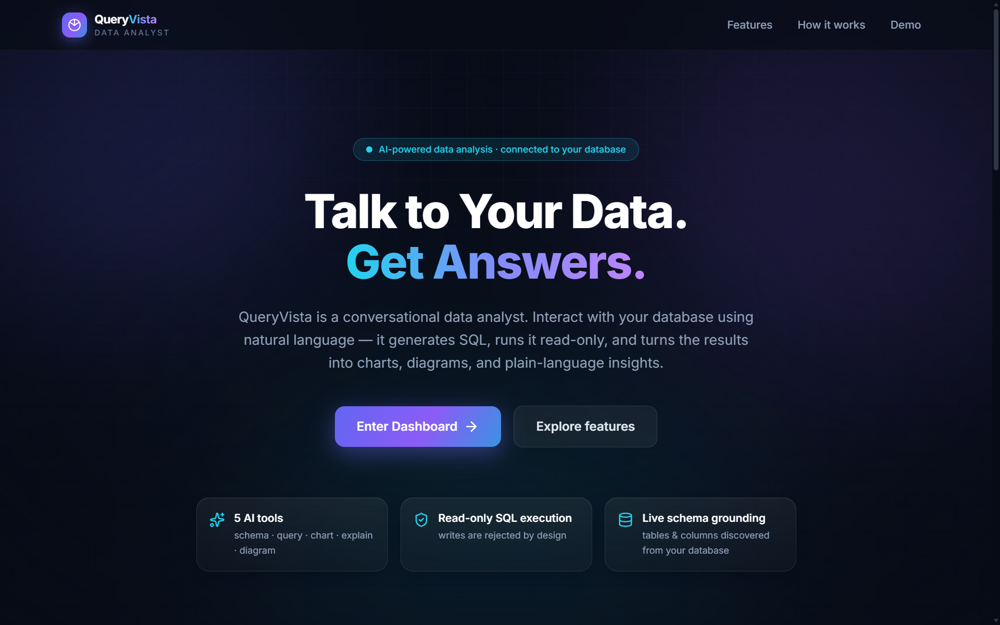

---

## Table of Contents

| | | |
|---|---|---|
| [1. Overview](#1-overview) | [8. Visualization & Diagram Engine](#8-visualization--diagram-engine) | [15. Example Conversations](#15-example-conversations) |
| [2. The Problem](#2-the-problem) | [9. Conversational Intelligence](#9-conversational-intelligence) | [16. Testing](#16-testing) |
| [3. The QueryVista Approach](#3-the-queryvista-approach) | [10. Technology Stack](#10-technology-stack) | [17. Deployment](#17-deployment) |
| [4. Key Capabilities](#4-key-capabilities) | [11. Project Structure](#11-project-structure) | [18. Hackathon Context](#18-hackathon-context) |
| [5. How QueryVista Works](#5-how-queryvista-works) | [12. Getting Started](#12-getting-started) | [19. Team](#19-team) |
| [6. System Architecture](#6-system-architecture) | [13. Environment Configuration](#13-environment-configuration) | [20. License](#20-license) |
| [7. Agent Tools](#7-agent-tools) | [14. Using QueryVista](#14-using-queryvista) | |

---

## 1. Overview

QueryVista turns a SQL database into something you can hold a conversation with.

It is built for anyone who needs answers from data but shouldn't have to write SQL to get
them — analysts exploring an unfamiliar schema, engineers who want a fast read on a
dataset, and non-technical stakeholders who know the question but not the query.

The distinguishing property is **grounding**. QueryVista never guesses at table or column
names: it discovers them from the connected database at request time, writes SQL against
what is actually there, and every figure in its answer traces back to rows the database
returned. The generated SQL is always shown, so any answer can be audited.

Bring your own SQLite file, or start immediately with the bundled e-commerce database.

---

## 2. The Problem

Getting an answer out of a database usually means crossing three gaps:

| Gap | What it demands |
|---|---|
| **Question → query** | SQL fluency, plus familiarity with this schema's tables, columns and joins |
| **Query → result** | Running it safely, without risking a write against production data |
| **Result → meaning** | Reading raw rows, then moving to a separate tool to chart or explain them |

Each gap filters people out. The person who has the question is frequently not the person
who can write the join — and by the time the answer arrives, the follow-up question has to
start the whole cycle again.

---

## 3. The QueryVista Approach

One conversation spans all three gaps. A question goes in; SQL, results, a chart and an
explanation come back together.

```
User question
     ↓
LangChain agent  ──►  get_schema        live tables, columns, types, keys
     ↓
SQL generation   ──►  execute_query     validated, read-only, row-capped
     ↓
Result rows
     ↓
     ├──►  generate_chart      Plotly spec, type chosen from data shape + intent
     ├──►  generate_flowchart  Mermaid ER / process diagram
     └──►  explain_data        plain-language read of the actual rows
     ↓
Response envelope  →  answer · SQL · table · chart · diagram · explanation
```

Safety is enforced in code rather than by prompting. `execute_query` runs a statement
through a dedicated validator before the database is touched, and the connection itself is
opened with SQLite's read-only URI mode — so a write cannot succeed even if one were
somehow generated.

---

## 4. Key Capabilities

| Capability | What it does |
|---|---|
| **Natural-language queries** | Ask in plain English; the agent decides which tools to call and in what order. |
| **Live schema discovery** | `get_schema` reads tables, columns, types, nullability, primary and foreign keys from the connected database at request time — no schema is hardcoded. |
| **Read-only SQL execution** | Only single `SELECT`/`WITH` statements run. 15 keyword families (`INSERT`, `UPDATE`, `DELETE`, `DROP`, `ALTER`, `TRUNCATE`, `CREATE`, `ATTACH`, `PRAGMA`, …) and multi-statement input are rejected before execution. |
| **SQL transparency** | Every data answer shows the exact statement that produced it, with a verified/error badge and one-click copy. |
| **Interactive charts** | Bar, line, pie and scatter, rendered with Plotly from a spec the backend builds. Downloadable as PNG. |
| **ER & process diagrams** | Mermaid entity-relationship diagrams generated from the live schema, and process flows built from agent-supplied steps. |
| **Grounded explanations** | `explain_data` narrates only what the returned rows support, with a deterministic fallback if the model is unavailable. |
| **Conversational context** | A bounded 6-turn memory plus the previous result set, so "which one generated the most?" resolves without re-asking. |
| **Bounded error recovery** | A failed query is surfaced to the agent for exactly one automatic correction, capped in code — never an unbounded retry loop. |
| **Bring your own database** | Upload any `.db` / `.sqlite` / `.sqlite3` file; it is validated and becomes that session's active database. |
| **Session isolation** | Each browser session maps to its own active database — one session's upload is never visible to another. |
| **Conversation history** | Recent conversations are kept per browser and can be reopened, each restoring its own agent context. |
| **Dark & light themes** | Both themes carry through the interface, charts and diagrams. Preference persists. |

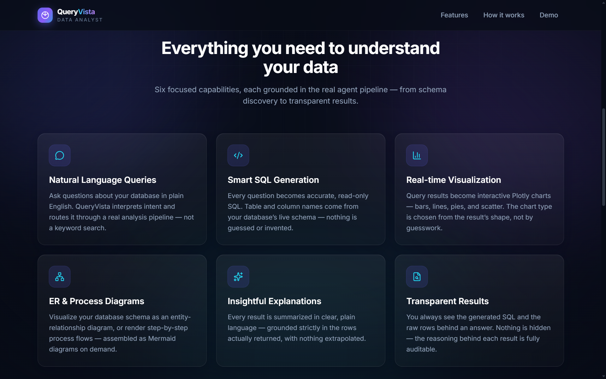
*The landing page states only what the system actually implements — five agent tools, read-only execution, and schema grounding.*

---

## 5. How QueryVista Works

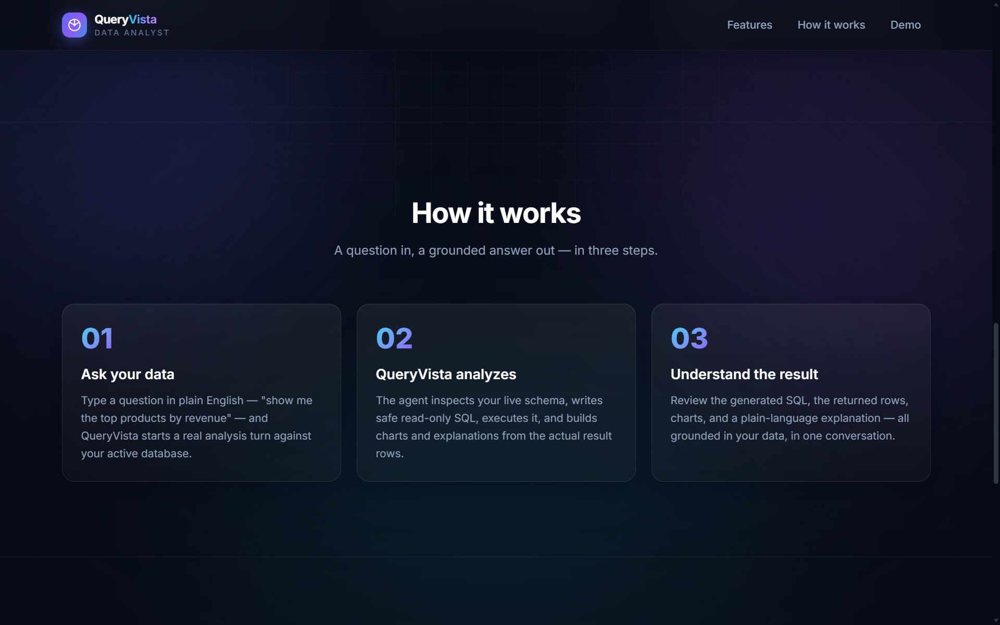

**01 · Ask** — You type a question. The agent classifies intent and plans which of its five
tools to use; a schema question and a data question take different paths.

**02 · Inspect** — `get_schema` returns the live structure of the active database. Results
are cached per session *and per database identity*, so switching databases mid-session can
never serve a stale schema.

**03 · Query** — The agent writes SQL from the discovered schema. `execute_query` strips
comments, rejects multi-statement input, confirms the statement is `SELECT`/`WITH`, and
scans for destructive keywords with quoted spans masked — so `SELECT 'delete' AS status`
and a column named `updated_at` both pass, while a real `DELETE` does not.

**04 · Execute** — The statement runs on a read-only connection under a row ceiling and a
statement timeout. Truncation is reported rather than hidden.

**05 · Visualize** — When the shape and the request warrant it, `generate_chart` produces a
Plotly spec, or `generate_flowchart` emits Mermaid syntax. If a chart would not add
clarity, none is produced — and the interface shows none.

**06 · Explain** — `explain_data` summarizes the result in plain language, bounded to the
rows actually returned. Large results are aggregated in code before the model sees them.

---

## 6. System Architecture

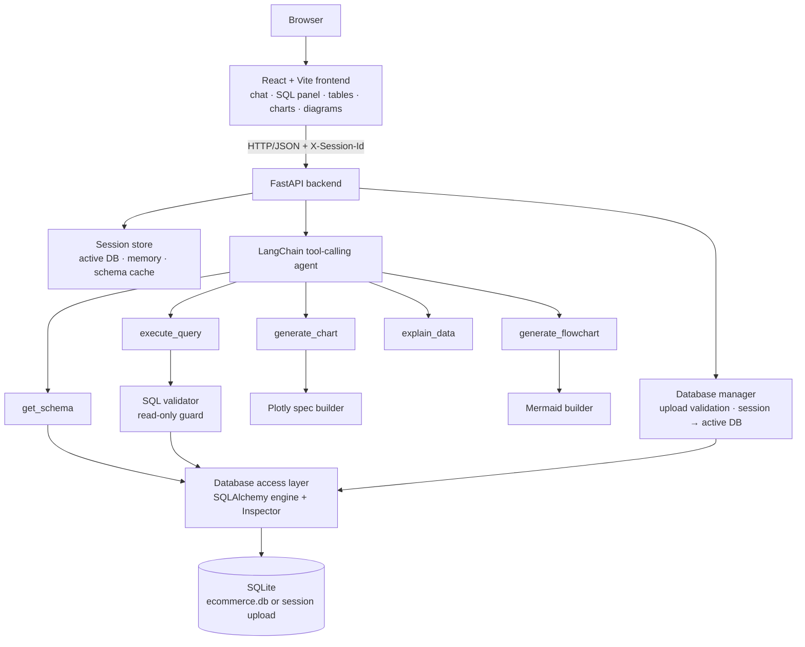

Three boundaries define the design:

- **The frontend never reaches the database.** It only ever sees the response envelope.
- **The LLM never executes SQL.** It can only request that `execute_query` run a statement,
  and that tool validates independently of anything the model was told.
- **The agent never chooses a database.** The database manager resolves `session_id → active
  database`; every tool simply operates on "the active database".

The backend runs as a single FastAPI process with an in-process agent. There is no message
queue, no external cache, and no separate model server.

---

## 7. Agent Tools

Five custom function-calling tools, each with a Pydantic input schema and a structured JSON
result. None of them takes `session_id` as an argument — the session travels through the
backend's execution context, so the model cannot address another user's database.

| Tool | Purpose | Input | Output |
|---|---|---|---|
| `get_schema` | Discover the live database structure | `table_filter?`, `refresh?` | `tables[]` with columns (name, type, nullable, primary key) and foreign keys, `table_count`, `cached` |
| `execute_query` | Run one validated read-only statement | `sql`, `max_rows?` | `columns[]`, `rows[][]`, `row_count`, `truncated` — or a typed error |
| `generate_chart` | Turn a bounded result into a chart spec | `data`, `intent?`, `x_field?`, `y_field?` | `chart_type` (`bar`/`line`/`pie`/`scatter`/`none`), `plotly_spec`, `title`, axis labels |
| `generate_flowchart` | Produce Mermaid syntax | `diagram_type` (`er`/`process`/`decision`), `context` | `mermaid_syntax`, `title` |
| `explain_data` | Narrate a result set | `data`, `question`, `chart?`, `correction_note?` | `explanation` |

They are designed to compose. A typical data turn runs `get_schema → execute_query →
generate_chart → explain_data`, with each tool's structured output feeding the next. A
schema question skips the query path entirely and goes straight to `generate_flowchart`.

Two contracts are worth calling out:

- **`generate_chart` and `generate_flowchart` contain no LLM calls.** They are pure
  functions. The model decides *what* to visualize; these modules decide *how* to render it.
- **`generate_flowchart` has no built-in process template.** For a process diagram the agent
  must supply the step graph itself; asking for one without steps returns
  `generation_failed` rather than a canned diagram.

---

## 8. Visualization & Diagram Engine

Chart type is resolved deterministically in the backend from the result's shape combined
with the phrasing of the request — not left to free-form model choice, so the same question
yields the same chart.

| Chart | Chosen when |
|---|---|
| **Bar** | A categorical column against a numeric one — the default for comparisons |
| **Line** | The x-axis is a date or time bucket (including `YYYY-MM` month grouping), or a line is explicitly requested |
| **Pie** | A share/proportion framing over a bounded set of categories |
| **Scatter** | Two numeric measures with a correlation framing |
| **none** | Scalars, empty results, all-text results, or a category column too high-cardinality to read — the interface then shows no chart at all |

Charts render through Plotly from a spec the backend builds, and every chart carries a
**Download chart** action that exports the rendered figure as a PNG.

Diagrams are Mermaid syntax produced by the backend and rendered client-side. ER diagrams
are derived from `get_schema`'s live output, so they describe whatever database is
currently active. Process flows are rendered from a step graph the agent reasons out.

Each of these is shown end-to-end in [Example Conversations](#15-example-conversations).

---

## 9. Conversational Intelligence

Each session keeps a bounded window of recent turns plus the most recent result set, so
follow-ups resolve against what was just discussed instead of starting over.

```
You    Show me the top 5 products by revenue.
       → SQL + 5 rows + bar chart + explanation

You    Which one generated the most revenue?
       → answers from the previous result set, without re-querying

You    Show me the monthly revenue trend as a line chart.
       → new query, line chart
```

Grounding is enforced on the response as well as the query. When a turn runs more than one
successful query, the prose is reconciled against the *final* result — so the narrative can
never describe one query while the SQL panel and table show another.

The agent is also bounded in code: a failed query gets exactly one automatic correction
attempt, and the tool-calling loop has a hard step ceiling. Neither depends on the prompt
behaving.

Destructive requests are declined conversationally rather than attempted:

> **You:** Delete all orders from the database.
>
> **QueryVista:** I am unable to delete records — I only have read-only access to the
> database and cannot perform write operations.

---

## 10. Technology Stack

| Layer | Technology |
|---|---|
| **Frontend** | React 19, Vite 8, Tailwind CSS 4, lucide-react |
| **Backend** | Python 3.11+, FastAPI, Uvicorn, Pydantic v2, pydantic-settings |
| **Agent** | LangChain 1.3 tool-calling agent with five custom `StructuredTool`s |
| **LLM providers** | OpenAI, Google Gemini, or Anthropic — selected at runtime by `LLM_PROVIDER` |
| **Database** | SQLite via SQLAlchemy 2 (Core + Inspector) |
| **Visualization** | Plotly (spec built server-side, rendered by `react-plotly.js`) |
| **Diagramming** | Mermaid 11 |
| **Testing** | pytest, httpx |
| **Containerization** | Docker (multi-stage images) + Docker Compose; Nginx serves the built frontend |
| **Tooling** | oxlint, python-dotenv |

The provider layer is a thin factory behind LangChain's chat-model interface, so switching
models is an environment change rather than a code change.

---

## 11. Project Structure

```
QueryVista/
├── backend/
│   ├── app/
│   │   ├── agent/            # agent service, tool registry, LLM provider,
│   │   │                     # memory, error recovery, tool trace
│   │   ├── tools/            # the five agent tools
│   │   ├── db/               # database manager, engine factory,
│   │   │                     # access layer, SQL validator
│   │   ├── viz/              # deterministic Plotly spec builder
│   │   ├── diagrams/         # Mermaid builder (ER / process / decision)
│   │   ├── routes/           # /api/chat, /api/database/*, /api/schema, /api/health
│   │   ├── session/          # session store + execution context
│   │   ├── models/           # Pydantic request/response contracts
│   │   ├── config.py         # environment-driven settings
│   │   └── main.py           # FastAPI app + CORS
│   ├── data/
│   │   ├── ecommerce.db      # seeded demo database (committed)
│   │   ├── seed.py           # idempotent seed script
│   │   └── uploads/          # session-uploaded databases (gitignored)
│   ├── tests/                # 19 test modules
│   ├── requirements.txt
│   └── Dockerfile            # backend image (multi-stage, Uvicorn)
├── frontend/
│   ├── src/
│   │   ├── pages/            # LandingPage, DashboardPage
│   │   ├── components/       # chat, SQL panel, result table, chart & diagram cards
│   │   ├── lib/              # session, conversation history, theme, formatting
│   │   ├── api/client.js     # backend client (sends X-Session-Id)
│   │   └── index.css         # design tokens + light/dark themes
│   ├── Dockerfile            # frontend image (Vite build → Nginx)
│   └── nginx.conf            # Nginx server config for the built SPA
├── docs/                     # PRD, TRD, architecture, tool contracts, test plan
├── screenshots/
├── docker-compose.yml        # backend + frontend services, volumes, healthcheck
├── .dockerignore
└── .env.example
```

---

## 12. Getting Started

### Prerequisites

- **Python 3.11+**
- **Node.js 18+**
- An API key for one supported LLM provider (OpenAI, Google Gemini, or Anthropic)

### Backend setup

```bash
cd backend
python -m venv venv

# Windows
venv\Scripts\activate
# macOS / Linux
source venv/bin/activate

pip install -r requirements.txt

# Create the seeded demo database (idempotent — safe to re-run)
python data/seed.py
```

### Environment

```bash
# from the project root
cp .env.example .env        # Windows: copy .env.example .env
```

Then set `LLM_PROVIDER` and `LLM_API_KEY` in `.env` (see
[Environment Configuration](#13-environment-configuration)).

### Frontend setup

```bash
cd frontend
npm install
```

### Run the application

QueryVista runs as two processes, so use **two terminals**.

```bash
# Terminal 1 — backend on http://localhost:8000
cd backend
uvicorn app.main:app --reload --port 8000
```

```bash
# Terminal 2 — frontend on http://localhost:5173
cd frontend
npm run dev
```

Open **http://localhost:5173**.

> The dev server is pinned to port **5173** because the backend's default
> `CORS_ALLOWED_ORIGINS` allows exactly that origin. If the port is already taken, Vite will
> stop with an error rather than silently move to another port and leave the API blocked —
> free the port, or add the new origin to `CORS_ALLOWED_ORIGINS`.

### Alternative: run with Docker

Everything above describes the local two-process setup. If you would rather not install
Python and Node at all, the repository also ships a Docker Compose stack that builds and
runs both services.

**Prerequisites:** Docker Engine with the Compose plugin (`docker compose`).

```bash
# from the project root
cp .env.example .env        # Windows: copy .env.example .env
```

Set `LLM_PROVIDER` and `LLM_API_KEY` in `.env`; Compose reads that file and passes the LLM
settings into the backend container. Then:

```bash
docker compose up --build
```

Open **http://localhost:5173** — the same URL as the local setup.

```bash
docker compose down          # stop the stack, keep the data volumes
docker compose down -v       # stop and delete the database + upload volumes
```

No seed step is needed: the seeded `ecommerce.db` is copied into the backend image at build
time, so the demo database is connected on first start.

---

## 13. Environment Configuration

All configuration is environment-driven; `.env.example` at the project root lists every
variable. The backend resolves `.env` from the project root regardless of which directory
you start it from.

| Variable | Purpose | Required |
|---|---|---|
| `LLM_PROVIDER` | `openai` \| `gemini` \| `anthropic` | Yes, for chat |
| `LLM_API_KEY` | API key for the selected provider | Yes, for chat |
| `LLM_MODEL` | Model override; a sensible per-provider default is used if blank | No |
| `DATABASE_URL` | Connection string for the default/demo database | No — defaults to `sqlite:///./data/ecommerce.db` |
| `DATABASE_UPLOAD_DIR` | Where session-uploaded databases are stored | No — defaults to `./data/uploads` |
| `DATABASE_UPLOAD_MAX_MB` | Upload size limit | No — defaults to `50` |
| `HARD_ROW_CEILING` | Server-enforced max rows; the agent can lower this but never raise it | No — defaults to `1000` |
| `DEFAULT_MAX_ROWS` | Row cap when the agent does not request one | No — defaults to `200` |
| `QUERY_TIMEOUT_SECONDS` | Statement timeout | No — defaults to `15` |
| `CORS_ALLOWED_ORIGINS` | Comma-separated allowed origins | No — defaults to `http://localhost:5173` |
| `BACKEND_HOST` / `BACKEND_PORT` | Bind address and port | No |
| `VITE_API_BASE_URL` | Backend base URL used by the frontend | No — defaults to `http://localhost:8000` |

`.env` is gitignored and must never be committed. Without an API key the backend still
starts and serves `/api/health` and every `/api/database/*` endpoint — chat returns a
structured `llm_unavailable` message instead of failing.

Under Docker the same variables apply, with two differences. Only `LLM_PROVIDER`,
`LLM_MODEL` and `LLM_API_KEY` are read from your root `.env` — Compose sets the remaining
backend variables itself (including `BACKEND_HOST=0.0.0.0`, so the container is reachable
from the host), so changing them means editing `docker-compose.yml` rather than `.env`. And
`VITE_API_BASE_URL` is a **build argument** baked into the frontend bundle at image build
time (`http://localhost:8000`); changing it requires a rebuild, not a restart.

---

## 14. Using QueryVista

1. Start both processes and open the dashboard.
2. The seeded **ecommerce.db** is connected by default — or upload your own SQLite file
   from **Active database → Upload database**.
3. Ask a question in plain English, or pick one of the suggested prompts.
4. Read the answer, then expand **Generated SQL** to see exactly what ran.
5. Review the result table, chart, or diagram beneath it.
6. Ask a follow-up — the agent keeps the thread's context.
7. Start a **New Chat** for a clean context, and reopen any recent conversation from the
   sidebar.

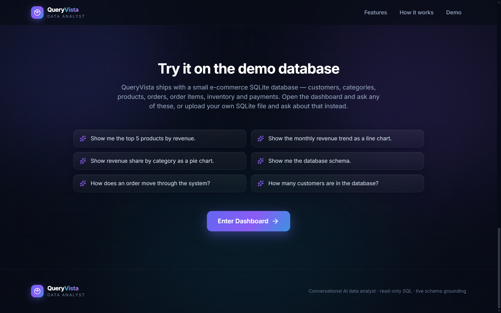

---

## 15. Example Conversations

### Product revenue → bar chart

> **"Show me the top 5 products by revenue."**

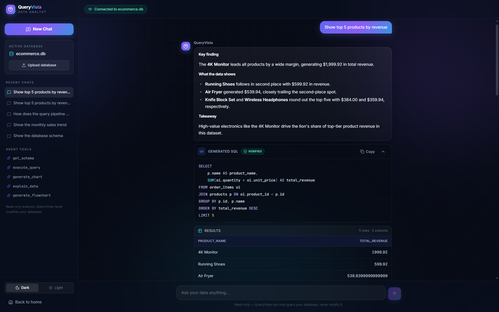

The answer leads with the finding, then exposes the generated SQL with a **verified** badge
and the result table underneath.

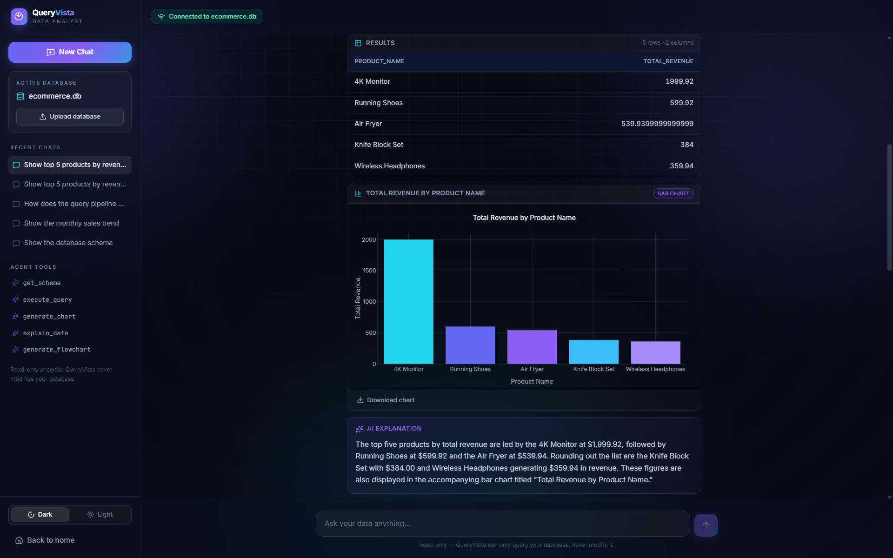

A bar chart follows for the comparison, with a **Download chart** action and an AI
explanation grounded in the same rows.

### Revenue trend → line chart

> **"Show me the monthly revenue trend over the available order history as a line chart."**

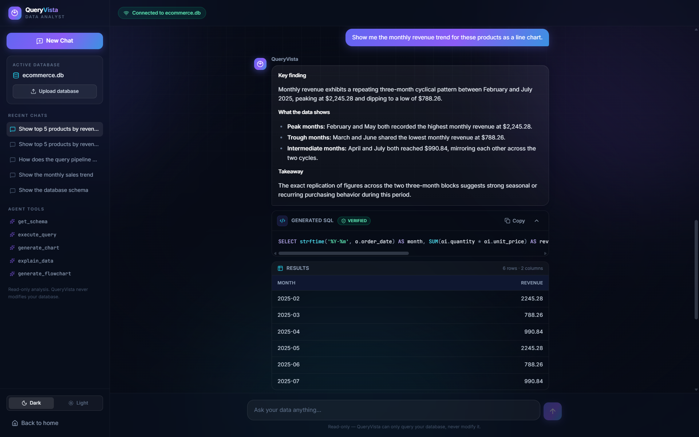
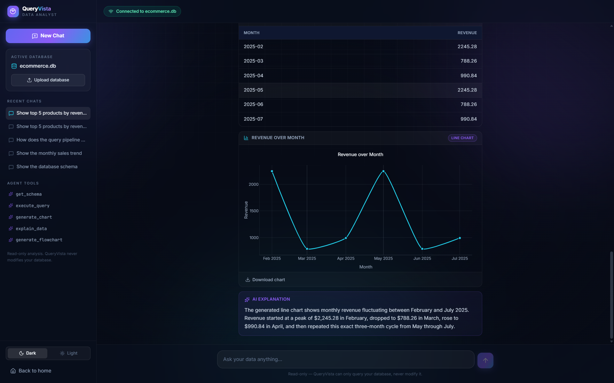

The month grouping is recognised as a time axis, so the result is drawn as a trend.

### Category share → pie chart

> **"Show me the revenue share by product category as a pie chart."**

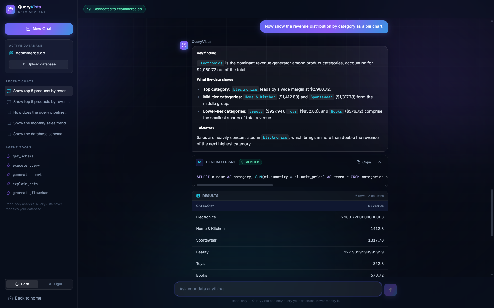
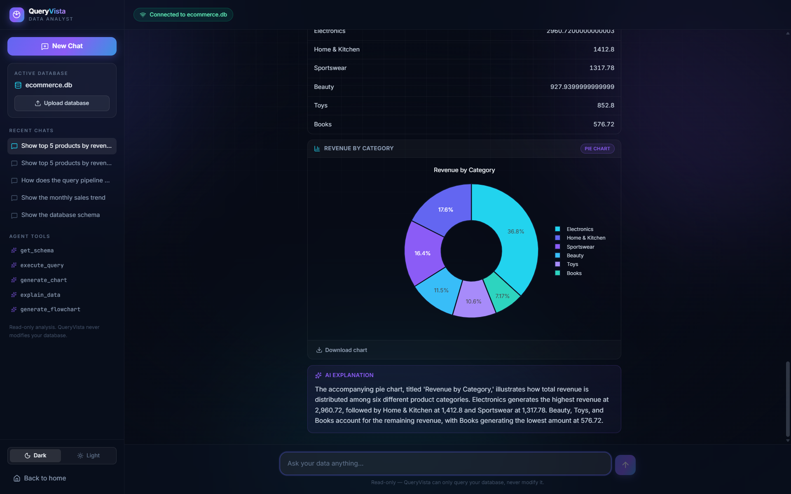

### Process understanding → flowchart

> **"Show me how an order moves from customer placement through payment and inventory."**

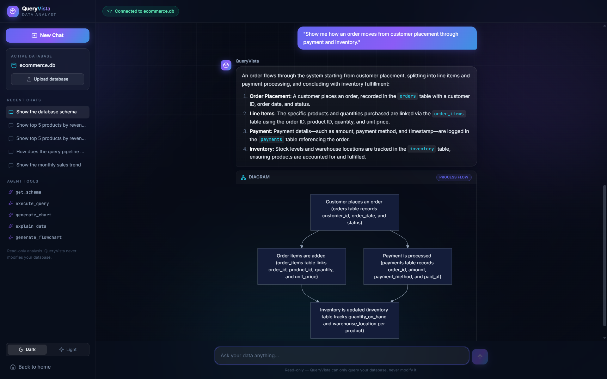

No SQL runs here. The agent reasons out the step sequence itself and passes it to
`generate_flowchart`, which renders it as Mermaid — the tool holds no built-in process
template, so the steps genuinely come from the request.

### Database structure → ER diagram

> **"Show me the complete ER diagram of my database, including all tables, columns, primary keys, foreign keys, and relationships."**

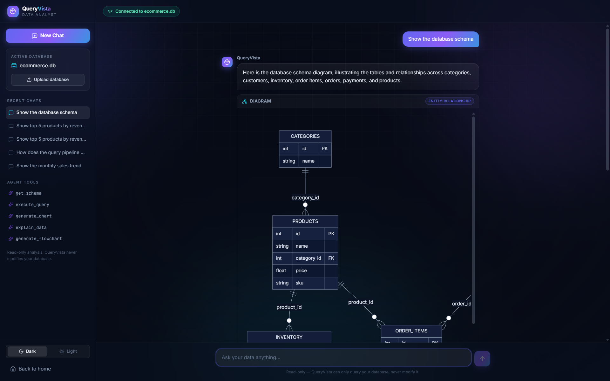

The diagram is generated from the live schema — every entity, column, key and relationship
comes from the connected database, not a stored picture.

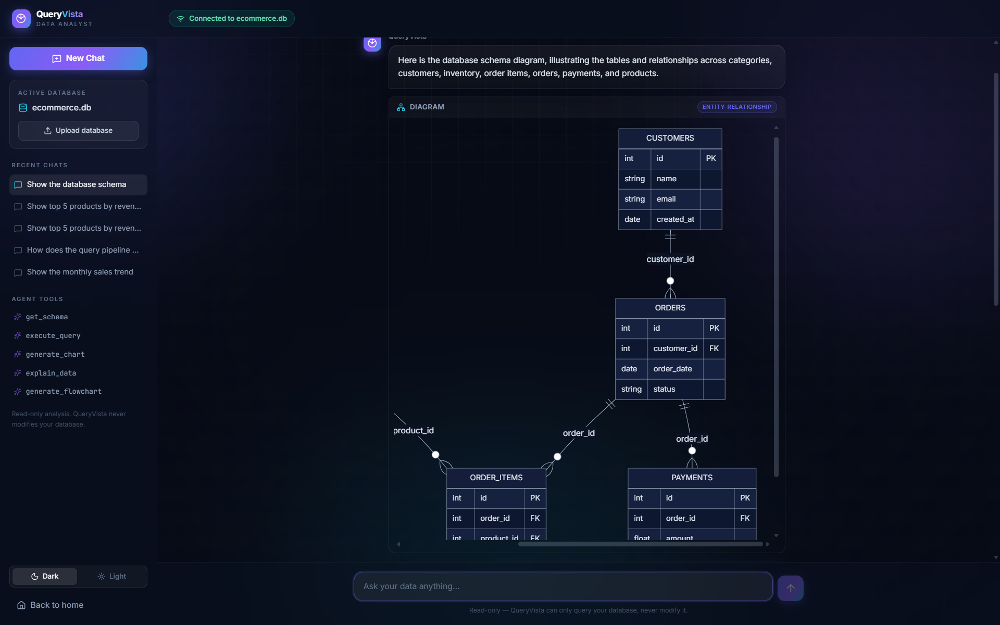

Large schemas stay readable at full scale inside a scrollable viewport rather than being
shrunk to fit.

---

## 16. Testing

```bash
cd backend
pytest -q
```

**290 tests pass** across 19 modules, covering the SQL validator and its named
false-positive regressions (`SELECT 'delete' AS status`, `updated_at`), read-only
enforcement, upload validation and path-traversal handling, session isolation, dynamic
schema discovery, chart-type selection, Mermaid generation, conversation memory, bounded
error recovery, and SQL transparency. Agent tests drive a scripted fake chat model, so the
suite is deterministic and needs no API key.

Frontend checks:

```bash
cd frontend
npm run lint     # oxlint
npm run build    # production build
```

Both pass. The test suite is meaningful but not exhaustive — there is no automated
browser/E2E layer, and the UI has been verified manually.

---

## 17. Deployment

QueryVista runs either as the local two-process setup — Uvicorn serving the FastAPI
backend, and Vite serving the frontend (`npm run build` produces a static bundle in
`frontend/dist`) — or as a containerized stack defined by `docker-compose.yml`.

```bash
docker compose up --build     # build both images and start the stack
docker compose down           # stop, keeping the data volumes
docker compose down -v        # stop and remove the volumes
```

Two services are defined:

| Service | Image build | Host port | Container |
|---|---|---|---|
| `backend` | `backend/Dockerfile` — `python:3.12-slim`, multi-stage (deps compiled in a builder stage, copied into a slim runtime) | `8000` → `8000` | `queryvista-backend`, running `uvicorn app.main:app --host 0.0.0.0 --port 8000` |
| `frontend` | `frontend/Dockerfile` — `node:20-alpine` builds the Vite bundle, `nginx:alpine` serves it | `5173` → `80` | `queryvista-frontend` |

Both images are built from the project root as the build context, with `.dockerignore`
excluding `.git`, `.env`, `venv/`, `node_modules/`, `dist/`, caches and SQLite journal
files.

Notes on how the stack behaves:

- **Service communication is browser-side, not container-to-container.** The frontend bundle
  is built with `VITE_API_BASE_URL=http://localhost:8000`, so the browser calls the
  published backend port directly. The backend's `CORS_ALLOWED_ORIGINS` is set to
  `http://localhost:5173`, which matches the published frontend port. `frontend` declares
  `depends_on: backend` for start ordering.
- **Nginx serves the built SPA** from `/usr/share/nginx/html` using `frontend/nginx.conf`,
  with an `index.html` fallback for client-side routes, gzip, long-lived caching for hashed
  assets, and `X-Frame-Options` / `X-Content-Type-Options` / `X-XSS-Protection` /
  `Referrer-Policy` headers.
- **SQLite and uploads persist in named volumes** — `queryvista-data` mounted at
  `/app/backend/data` and `queryvista-uploads` at `/app/backend/data/uploads` — so the
  demo database and any uploaded databases survive `docker compose down`.
- **The backend has a healthcheck** that polls `GET /api/health` with `curl` every 30s
  (10s timeout, 3 retries, 10s start period).

There is no CI configuration in this repository, and no cloud/orchestration deployment is
defined beyond this Compose stack.

---

## 18. Hackathon Context

QueryVista was built for the **iTech AI Innovation Hackathon 2026** (1–7 August 2026),
under the challenge *Building Intelligent LLM Agents for Database Interaction &
Visualization*.

The challenge asks for a conversational application in which an LLM agent understands
natural-language data questions, queries a real database, visualizes the results, explains
them, and does so through custom function-calling tools. QueryVista addresses that with an
agent whose entire capability surface is five explicitly-defined tools — schema discovery,
validated read-only execution, chart generation, diagram generation, and explanation —
composed at runtime against whichever database the session has connected.

---

## 19. Team

QueryVista was built by a team of student developers for the **iTech AI Innovation Hackathon 2026**.

| Member | Role | Contribution |
|---|---|---|
| **Niyati R** | AI/ML & Agent Engineering | LLM agent, tool orchestration, SQL reasoning |
| **Likitha T** | Backend & Database Engineering | API layer, database integration, query execution |
| **Akshaya VM** | Frontend & Visualization Engineering | React interface, charts, diagrams, user experience |

---

## 20. License

No license file is currently included in this repository. All rights reserved by the
authors unless a license is added.
