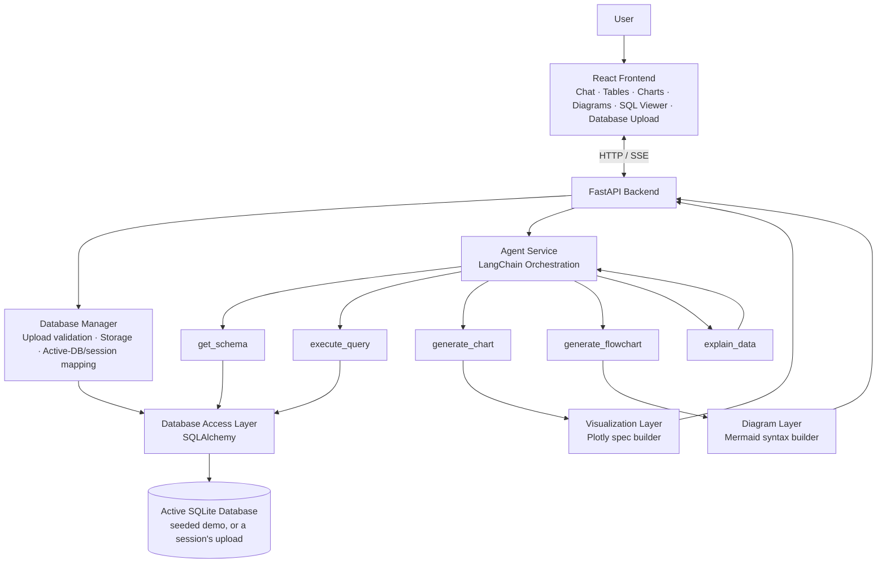
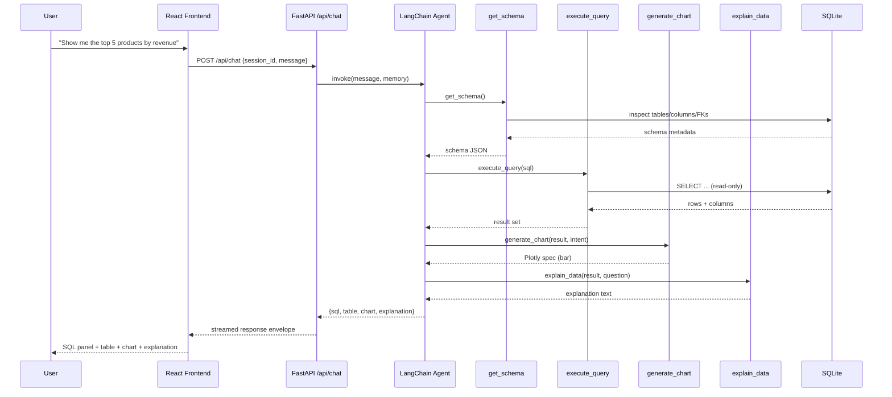
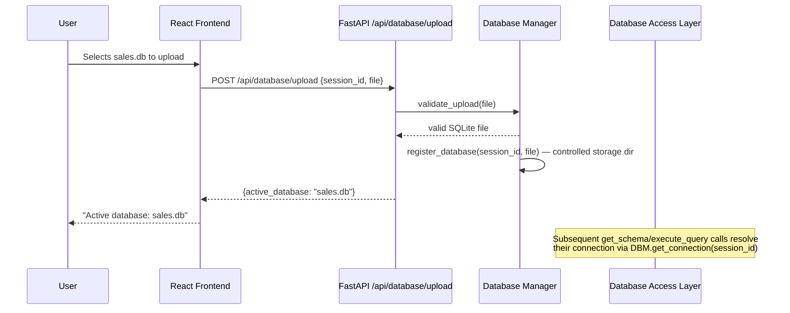
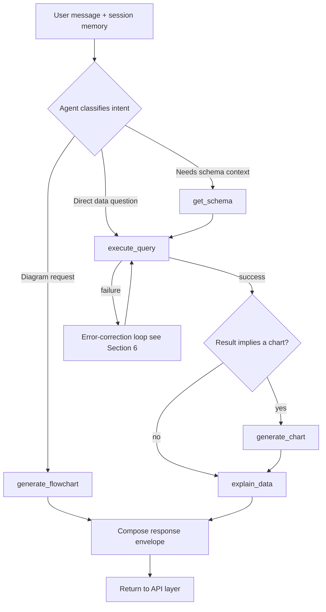
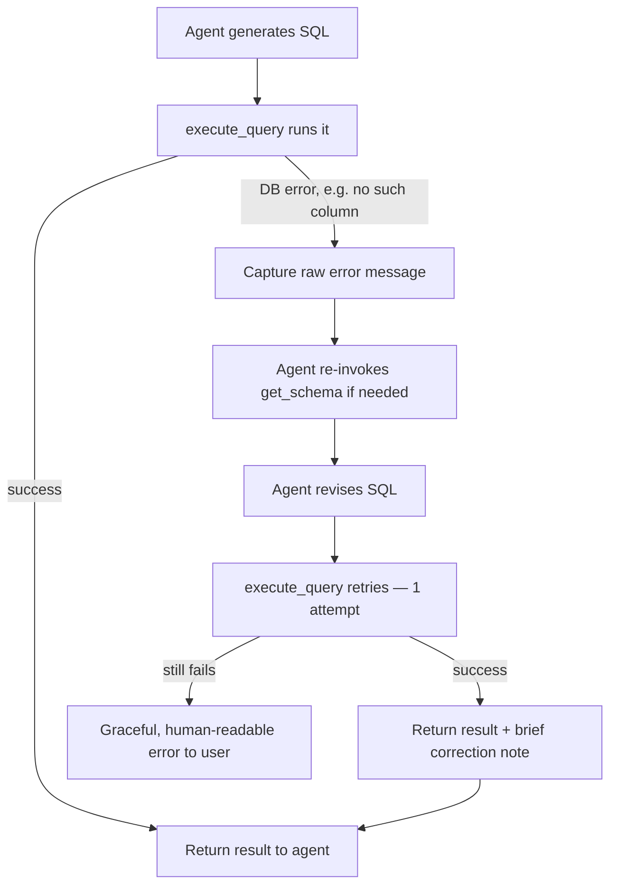
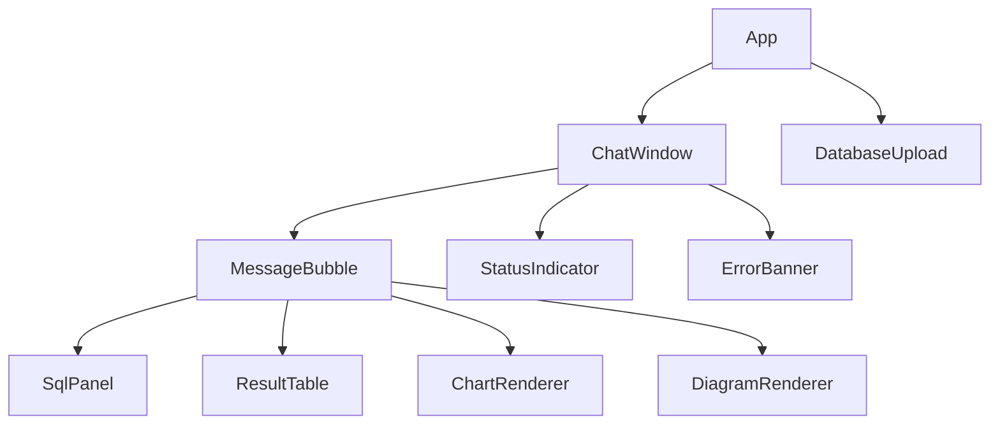
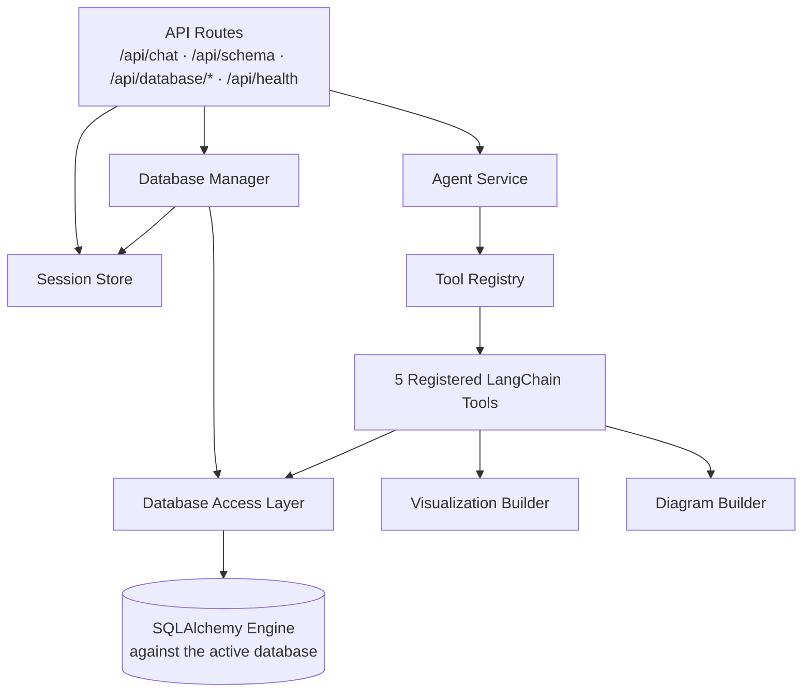
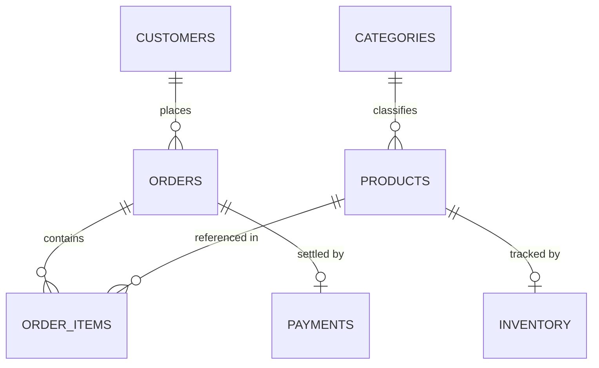
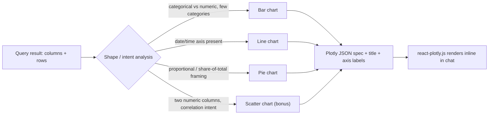
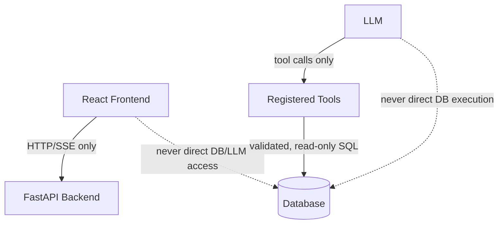

# System Architecture Document

**Project:** AI Data Analyst — Conversational Database Intelligence
**Companion documents:** `01_PRD.md` (what/why), `02_TRD.md` (technology
choices and why)
**Purpose:** define the concrete structure, data flow, and boundaries that
implementation will follow phase by phase.

---

## 1. System Architecture Overview

This mirrors the layering proposed in the TRD: **Presentation → API →
Database Manager (source selection) → Agent orchestration → Tools →
Database / Visualization / Diagram**, with conversation state held
alongside the API layer (see §7). The Database Manager sits between the
API layer and the Database Access Layer precisely so the agent and the
five tools never need to know whether the active SQLite file is the seeded
demo database or a session's upload (PRD §5.9) — they only ever see "the
active database," resolved for them.

---

## 2. Component Architecture

| Component | Responsibility | Talks to |
|---|---|---|
| React Frontend | Renders chat, tables, charts, diagrams, SQL panel, and the database upload/active-database affordance; owns UI-only state | FastAPI backend only |
| FastAPI Backend | HTTP/SSE API surface, request validation, session lookup, invokes Database Manager and Agent Service | Database Manager, Agent Service, Session Store |
| Database Manager | Validates uploaded SQLite files, stores them in a controlled directory, maps `session_id → active database`, and hands the resolved connection to the Database Access Layer (PRD §5.9) | FastAPI Backend, Database Access Layer, Session Store |
| Session Store | In-memory map of session id → conversation history + LangChain memory + active-database reference | FastAPI Backend, Database Manager |
| Agent Service (LangChain) | Interprets intent, decides which tool(s) to call, sequences multi-step reasoning, applies error-correction loop | Registered Tools, LLM Provider |
| LLM Provider Client | Thin, provider-agnostic wrapper selected by `LLM_PROVIDER` env var | External LLM API |
| `get_schema` tool | Dynamic schema discovery against the currently active database | Database Access Layer |
| `execute_query` tool | Validates + executes read-only SQL against the currently active database | Database Access Layer |
| `generate_chart` tool | Chooses chart type, builds Plotly spec | (pure function of tabular data + intent) |
| `generate_flowchart` tool | Builds Mermaid syntax (ER / process / decision tree) | Database Access Layer (for ER, against the active database), Agent context (for process/decision) |
| `explain_data` tool | Produces natural-language explanation | Agent context (result set, chart spec) |
| Database Access Layer | Single point of SQLAlchemy engine/Inspector use against whichever database the Database Manager reports as active; enforces read-only | Database Manager, SQLite (or future backend) |

Each component maps 1:1 onto a PRD feature (§5) and a TRD technology choice
(§1), keeping all three documents consistent.

---

## 3. Data Flow — Single Query Turn

**Database Upload Flow** (precedes the turn above whenever the user uploads
a database; otherwise the session simply uses the default demo database
with no upload step):

An invalid or unreadable upload is rejected at the `DBM.validate_upload`
step and returns a structured error (Architecture §6); the session's
previously-active database (default or a prior valid upload) is left
untouched.

---

## 4. Agent / Tool Orchestration Flow

The agent decides tool sequencing at runtime; the sequence above is the
common path, not a hardcoded pipeline — a diagram-only request (e.g.,
"draw the ER diagram") skips `execute_query`/`generate_chart` entirely.

---

## 5. Tool Architecture (Contracts)

Every tool receives a Pydantic-validated input and returns a structured
JSON output, so the agent, the API layer, and the frontend never depend on
parsing free text.

| Tool | Input (indicative) | Output (indicative) |
|---|---|---|
| `get_schema` | *(none, or optional table filter)* | `{ tables: [{ name, columns: [{name, type}], foreign_keys: [...] }] }` |
| `execute_query` | `{ sql: str }` | `{ columns: [str], rows: [[...]], row_count: int }` or `{ error: str }` |
| `generate_chart` | `{ data: {columns, rows}, intent: str }` | `{ chart_type: "bar"\|"line"\|"pie"\|"scatter", plotly_spec: {...}, title: str }` |
| `generate_flowchart` | `{ diagram_type: "er"\|"process"\|"decision", context: {...} }` | `{ mermaid_syntax: str, title: str }` |
| `explain_data` | `{ data: {...}, chart?: {...}, question: str }` | `{ explanation: str }` |

This directly satisfies TRD §4's requirement for explicit schemas and
structured I/O, and PRD FR-2/NFR-2.

---

## 6. Error Recovery Flow

Rules applied here:
- Exactly one automatic retry, to bound latency and cost.
- The user is told, briefly, that a correction happened — never shown a raw
  driver exception.
- The same pattern (capture → interpret → retry-once → graceful fallback)
  is reused for `generate_chart` and `generate_flowchart` failures (e.g.,
  empty result set → no chart, explained in text instead of erroring).

Other failure modes and their handling:

| Failure | Handling |
|---|---|
| Empty query result | Agent responds with a plain-language "no matching data" message; no chart/diagram is forced. |
| Missing table/column referenced by user | Agent re-checks schema, asks a clarifying question or maps to the closest real column, rather than failing silently. |
| Database connection failure | `execute_query`/`get_schema` catch the connection error; API returns a structured error the frontend renders via `ErrorBanner`; no stack trace reaches the client. |
| LLM/provider failure (timeout, rate limit) | API layer catches the exception, returns a structured error envelope; frontend shows a retry-affordance message. |
| Visualization failure (e.g., unchartable shape) | `generate_chart` returns a "no suitable chart" signal; the agent falls back to `explain_data` only, still returning the result table. |
| Unsupported request (e.g., write operation implied) | Rejected before reaching the database, with a message explaining the system is read-only. |
| Invalid/corrupt database upload | `Database Manager.validate_upload` rejects the file before it is registered or opened; the API returns a structured error the frontend renders via `ErrorBanner`, and the session's previously-active database (default or a prior upload) remains active and untouched. |

---

## 7. Conversation Flow & State Management

- The frontend generates (or receives from the backend on first load) a
  `session_id` and includes it on every `/api/chat` request.
- The backend's **Session Store** (in-memory dict for this hackathon scope)
  holds, per session:
  - The LangChain conversation memory object (recent turns).
  - The most recent result set(s) (so "these products"/"the fastest one"
    can be resolved without re-querying when possible).
  - The session's active-database reference, as set by the Database
    Manager (PRD §5.9) — the demo database until/unless the session
    uploads a file, and the most recently uploaded file thereafter.
- On each turn, the agent is invoked with the current message **and** this
  memory, so entity references from prior turns are available as context
  when the agent decides how to interpret the new message.
- Memory is bounded (recent-turn window) per TRD §13, to keep prompts within
  context limits on longer sessions.
- Session state is **process-local and ephemeral** by design (no external
  cache/DB for sessions) — acceptable because the deployment target is a
  single local/demo instance, consistent with Rule 12 (prefer simple
  implementations for a short hackathon timeline).

---

## 8. Frontend Architecture

- `ChatWindow` owns the message list and session id, and issues requests to
  `POST /api/chat`.
- `DatabaseUpload` lets the user select/upload a SQLite file, calls
  `POST /api/database/upload`, and displays the active-database indicator
  (via `GET /api/database/current`) — it shares the same `session_id` as
  `ChatWindow` but is otherwise independent of the message list.
- `MessageBubble` renders one turn; for agent turns it conditionally renders
  `SqlPanel` → `ResultTable` → `ChartRenderer`/`DiagramRenderer`, matching
  the required "Generated SQL → Query Result → Visualization → AI Insights"
  order from the PRD.
- `StatusIndicator` reflects streamed status events (e.g., tool-in-progress
  markers) from the backend so the user sees agent/tool activity rather
  than a blank wait.
- `ErrorBanner` renders any structured error envelope in plain language,
  including a rejected/invalid database upload.
- The frontend **never** calls the database or the LLM provider directly —
  only the FastAPI backend (Architecture Rule 1, enforced by having no
  database/LLM credentials present in frontend code or environment at all).
  This applies equally to `DatabaseUpload`: the uploaded file is sent to
  the backend and never opened or inspected client-side.

---

## 9. Backend Architecture

- **API Routes** — thin FastAPI route handlers; validate requests with
  Pydantic, look up/create session state, delegate to the Database Manager
  (`/api/database/*`) or the Agent Service (`/api/chat`), and shape the
  structured response envelope (or SSE stream) for the frontend.
- **Database Manager** — validates and stores uploaded SQLite files,
  resolves each session's active database (default demo database, or that
  session's most recent valid upload), and is the only component that
  decides *which* database file the Database Access Layer should connect
  to (PRD §5.9). It records the active-database reference in the Session
  Store so it survives across turns within the same session.
- **Agent Service** — wraps the LangChain agent executor, injects the
  correct LLM client (via the provider factory, TRD §4), the tool registry,
  and the session's memory.
- **Tool Registry** — the single place all five tools are constructed and
  registered, so adding a sixth tool later (extensibility) means adding one
  entry here, not touching routing or agent-invocation code.
- **Database Access Layer** — the only module that imports SQLAlchemy's
  engine/Inspector; `get_schema` and `execute_query` depend on it rather
  than opening their own connections (Rule 5/Rule 7), and it always
  connects to whichever file the Database Manager currently reports as
  active for the session.
- **Visualization Builder / Diagram Builder** — pure-function-style modules
  used by `generate_chart`/`generate_flowchart`; they hold no LLM-calling
  logic themselves (Rule 9/Rule 10) — the LLM decides *intent*, these
  modules decide *representation*.

---

## 10. Database Architecture

- This is the **default/sample dataset's** conceptual shape (per PRD §12),
  used to build the seeded demo SQLite database that ships with the repo.
- Critically, **no code path hardcodes this shape**: `get_schema` derives
  the actual ER diagram and column list from `SQLAlchemy Inspector` at
  runtime, against whichever database is currently active. The diagram
  above documents the seed data for planning purposes, not a contract the
  agent assumes — a session with an uploaded `hospital.db` would produce a
  completely different ER diagram from the same `get_schema` →
  `generate_flowchart` path, with no code change.
- `DATABASE_URL` configures the **default/sample database's** connection
  string. At runtime, the Database Manager resolves each session's
  *active* database — either that default, or a file the session has
  uploaded — and hands the corresponding connection to the Database Access
  Layer; `DATABASE_URL` is not involved in serving an uploaded database.
  This satisfies the requirement that an organizer-provided database (or,
  later, a non-SQLite backend) could still be substituted for the default
  via `DATABASE_URL` alone, without rewriting the agent, tools, or
  frontend.

---

## 11. Visualization Flow

The decision rules mirror TRD §6 exactly, so PRD, TRD, and this document
describe one chart-selection policy, not three different ones.

---

## 12. Security Boundaries

Enforced boundaries:
1. **Frontend ↔ Database:** no path exists; all data reaches the frontend
   through the backend's structured response envelope (Rule 1). The
   frontend never receives the uploaded database's file path or a direct
   connection string — only the active database's *name* for display.
2. **LLM ↔ Database:** the LLM never executes SQL itself; it can only
   request that the `execute_query` tool run a statement, and that tool
   independently validates the statement before touching the database
   (Rule 2, Rule 6).
3. **Read-only enforcement:** implemented in the Database Access Layer, not
   merely by prompt instruction — statement-keyword validation rejects
   `DROP`/`DELETE`/`UPDATE`/`INSERT`/`ALTER`/`TRUNCATE` and multi-statement
   payloads before execution, uniformly for the default database and for
   any uploaded database.
4. **Secrets:** LLM API keys and database credentials live only in backend
   environment variables, never in frontend bundles or source control.
5. **Error surface:** internal exception details are logged server-side and
   translated to safe, structured messages before reaching the client.
6. **Upload boundary:** an uploaded file is only ever validated and opened
   by the Database Manager/Database Access Layer as a SQLite database — it
   is never executed, and it is stored under a controlled, backend-owned
   directory with a generated filename (path-traversal prevention, PRD
   NFR-9).
7. **Session isolation:** the Database Manager's `session_id → active
   database` mapping ensures one session's uploaded database is never
   reachable from another session's requests (PRD FR-16).

---

## 13. Extensibility

| Extension scenario | How the architecture accommodates it |
|---|---|
| User uploads a differently-shaped SQLite database | Already the MVP path (PRD §5.9): the Database Manager registers it as the session's active database; `get_schema`'s Inspector-based discovery and every downstream tool adapt automatically, with no agent/tool code change. |
| Swap the *default* database's backend to Postgres/MySQL | Change `DATABASE_URL`; the Database Access Layer and `get_schema`'s Inspector-based discovery are backend-agnostic. A non-SQLite *upload* path is not implemented in this pass (PRD §12) but would only require extending `Database Manager.validate_upload`/`get_connection`, not the agent or tools. |
| Switch LLM provider | Change `LLM_PROVIDER`/`LLM_MODEL`/`LLM_API_KEY`; the Agent Service's provider factory is the only integration point. |
| Add a sixth tool | Implement it against the same input/output-schema convention and register it in the Tool Registry; no changes to routing, memory, or the frontend's rendering contract are required as long as the response envelope shape is respected. |
| Add a new chart type | Extend the Visualization Builder's shape-analysis rules and the frontend's `ChartRenderer` switch; no agent or database changes needed (Rule 9). |
| Add decision-tree diagrams (bonus) | Extend the Diagram Builder with a third `diagram_type` branch; `generate_flowchart`'s contract already supports arbitrary diagram types. |

---

## 14. Architecture Principles (Enforced Rules)

1. **Frontend never accesses the database directly.**
2. **The LLM never directly executes database operations** — only through
   registered tools.
3. **Each of the five tools is modular and independently testable**, with
   its own input/output schema.
4. **Tools return structured responses** the agent and frontend can both
   interpret without free-text parsing.
5. **Schema discovery is dynamic** — no hardcoded schema in the agent.
6. **SQL execution is read-only**, enforced in code, not just by prompt.
7. **The database connection is configurable** via `DATABASE_URL`.
8. **The LLM provider is configurable** via environment variables.
9. **Visualization logic is separated from the LLM** — the LLM decides
   *what*, the Visualization Builder decides *how to render it*.
10. **Mermaid diagram generation is separated from diagram rendering** —
    tools produce syntax, the frontend renders it.
11. **No unnecessary frameworks or microservices** are introduced.
12. **Implementations stay simple and modular**, appropriate to a
    short hackathon timeline, without sacrificing the mandatory
    requirements in `01_PRD.md`.
13. **The database source is separated from the agent and tools** — the
    Database Manager alone decides whether the active database is the
    seeded demo database or a session's upload; the agent and all five
    tools operate only against "the active database" and never branch on
    its origin.
14. **The active database is session-scoped** — one session's uploaded
    database is never queried by, or visible to, another session.
15. **Uploaded files are validated and controlled, never executed** — every
    upload is checked as a genuine SQLite file, stored under a
    backend-owned directory with a generated filename, and only ever
    opened through the existing SQLAlchemy connection path.

---

## 15. Document Relationship

This architecture document is the concrete realization of the technology
decisions in `02_TRD.md` and exists to satisfy the product requirements in
`01_PRD.md`. Tool names, environment variables, component names, and the
technology stack are identical across all three documents; any future
change to one (e.g., adding a tool, changing a provider) must be reflected
in all three to keep them a single connected documentation system.
