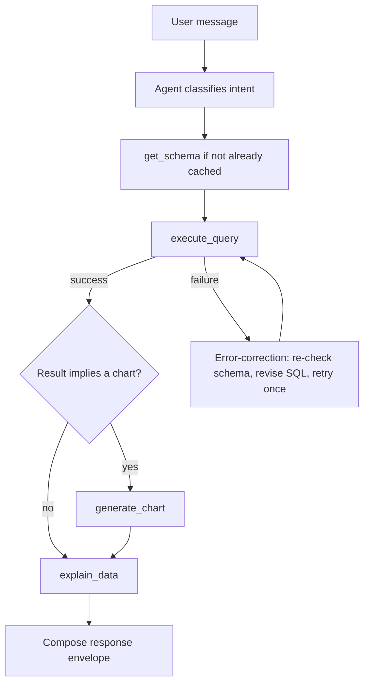

# Agent Tools Specification

**Project:** AI Data Analyst — Conversational Database Intelligence
**Companion documents:** `01_PRD.md` (what/why), `02_TRD.md` (technology
choices), `03_ARCHITECTURE.md` (system structure), `05_IMPLEMENTATION_PLAN.md`
(build order), `06_TESTING_CHECKLIST.md` (verification)
**Purpose:** give Claude Code a precise, implementation-ready contract for
each of the five mandatory LangChain tools, so tool behavior is determined by
this document rather than improvised during coding.

This document does not introduce any new technology, tool, or architectural
decision beyond what `02_TRD.md` and `03_ARCHITECTURE.md` already specify. It
takes their *indicative* tool contracts (Architecture §5) and makes them
concrete and testable, and folds in the five clarifications from the task
brief (streaming, SQL enforcement, result size, chart selection, simplicity).

**Scope tag legend used throughout:** `MUST` (required for a working demo),
`SHOULD` (important reliability/UX, implement if Day 1–2 time allows),
`BONUS` (only after all `MUST`/`SHOULD` items across the whole project are
stable).

---

## 0. Shared Conventions (apply to all five tools)

- Every tool is a LangChain structured tool with a Pydantic input model and
  returns a Pydantic-serializable structured output — never a free-text
  string the agent or frontend must parse (Architecture Rule 4, TRD §4).
- Every tool output includes a top-level `"success": bool`. On failure, an
  `"error": { "type": str, "message": str }` object is returned instead of
  (not alongside) the tool's normal success payload.
- No tool raises an uncaught exception across its public boundary. Internal
  exceptions are caught at the tool's outer function, logged server-side with
  full detail, and converted into the structured error shape (Architecture
  Rule 4, TRD §9).
- No tool imports the SQLAlchemy engine, LLM client, or Plotly/Mermaid
  builder directly and independently of the layer that owns it — `get_schema`
  and `execute_query` go through the Database Access Layer only;
  `generate_chart` through the Visualization Builder only; `generate_flowchart`
  through the Diagram Builder (and the Database Access Layer, ER-only);
  `explain_data` through the LLM Provider Client only (Architecture §9,
  Rules 5/9/10).
- None of the five tools renders pixels, images, or SVG. `generate_chart`
  returns a Plotly JSON spec; `generate_flowchart` returns Mermaid syntax
  text. Rendering is exclusively the frontend's job (Architecture Rule 9/10).
- None of the five tools knows or cares whether the database it is working
  against is the seeded demo database or a database the current session has
  uploaded (PRD §5.9). That resolution happens once, in the Database
  Manager/Database Access Layer (`03_ARCHITECTURE.md` §2/§9), before any
  tool runs; every tool below simply operates on "the active database."

---

## TOOL 1 — `get_schema`

**Scope:** `MUST`

### 1. Tool name
`get_schema`

### 2. Purpose
Dynamically discover the **currently active** database's tables, columns,
data types, primary keys, and foreign-key relationships, so the agent (and,
downstream, `generate_flowchart`'s ER mode) never depends on a hardcoded
schema. The active database is resolved by the Database Manager
(`02_TRD.md` §5, `03_ARCHITECTURE.md` §2/§9) and may be the seeded demo
database or a database the user has uploaded for this session (PRD §5.9) —
`get_schema` itself is unaware of, and indifferent to, which one it is.
This is the direct implementation of FR-3 and Architecture Rule 5/13.

### 3. When the agent should call it
- At the start of a session, or the first time a data question is asked,
  before generating any SQL.
- Whenever the agent is about to reference a table/column name it has not
  already confirmed exists in the current session's cached schema.
- As part of the error-correction loop (§ below, and Architecture §6), when
  `execute_query` fails with a "no such table"/"no such column"-shaped error,
  to re-verify the real names before retrying.
- Before building an ER diagram request (`generate_flowchart` with
  `diagram_type="er"`), unless a fresh schema is already cached this session.
- With `refresh=true` if the agent has reason to believe the schema may have
  changed mid-session (rare in this hackathon's read-only, single-file SQLite
  context, but the contract must not assume it never happens).

### 4. When the agent should NOT call it
- On every single turn regardless of need — if the session already has a
  cached schema and the current request does not touch a new table/column,
  re-calling `get_schema` wastes a turn and latency.
- When the user's request is purely about a prior result already held in
  conversation memory (e.g., "which one grew fastest?" over data already
  fetched) and does not require new schema knowledge.
- When the user's request is a pure diagram request whose `diagram_type` is
  `"process"` or `"decision"` and no schema-derived content is needed — the
  agent can reason directly to a `context.steps`/`context.entities` graph
  without first calling `get_schema` (see Tool 4).

### 5. Input schema

| Field | Type | Required | Description | Validation rules |
|---|---|---|---|---|
| `table_filter` | `List[str]` | No (default `None`) | Restrict discovery to specific table names, when the agent already knows it only needs a subset. | If provided, must be a non-empty list of non-empty strings. Unknown table names are silently omitted from the result (not an error) rather than rejecting the whole call. |
| `refresh` | `bool` | No (default `false`) | Bypass the session-level schema cache and re-inspect the live database. | Must be a boolean. |

### 6. Output schema

**Success:**
```json
{
  "success": true,
  "tables": [
    {
      "name": "products",
      "columns": [
        { "name": "id", "type": "INTEGER", "nullable": false, "primary_key": true },
        { "name": "name", "type": "VARCHAR", "nullable": false, "primary_key": false },
        { "name": "category_id", "type": "INTEGER", "nullable": true, "primary_key": false }
      ],
      "foreign_keys": [
        { "column": "category_id", "references_table": "categories", "references_column": "id" }
      ]
    }
  ],
  "table_count": 7,
  "cached": false
}
```

**Error:**
```json
{
  "success": false,
  "error": { "type": "database_unavailable", "message": "Could not connect to the configured database." }
}
```

| Field | Type | Notes |
|---|---|---|
| `success` | `bool` | Required, always present. |
| `tables` | `List[TableSchema]` | Required on success; may be an empty list for a database with no tables (not an error condition). |
| `table_count` | `int` | Required on success; `len(tables)`, provided so the agent/frontend don't need to compute it. |
| `cached` | `bool` | Required on success; `true` if served from the session cache instead of a fresh Inspector call. |
| `error.type` | `"database_unavailable" \| "schema_discovery_failed"` | Required on failure. |
| `error.message` | `str` | Required on failure; sanitized (no connection strings, no file paths). |

### 7. Dependencies
- Database Access Layer (single owner of the SQLAlchemy engine and
  `Inspector`, per Architecture §9), which in turn connects to whichever
  database the Database Manager currently reports as active for the
  session (Architecture §2/§13).
- Session Store, for the optional schema cache (Architecture §7) — keyed by
  `session_id` plus a reference to the session's active database (as
  resolved by the Database Manager, not a raw `DATABASE_URL`), so a
  mid-session database upload/switch is never silently served stale
  schema data.

### 8. Internal processing flow
1. If `refresh` is `false` and a cache entry exists for this session and the
   session's currently active database has not changed since that cache was
   written, return the cached schema (marking `cached: true`) filtered by
   `table_filter` if provided.
2. Otherwise, obtain the `Inspector` from the Database Access Layer's engine
   (which the Database Access Layer has connected to the session's active
   database, per the Database Manager).
3. List table names (`inspector.get_table_names()`), intersected with
   `table_filter` if provided.
4. For each table, call `get_columns`, `get_pk_constraint`, and
   `get_foreign_keys`; assemble each column's `name`, `type` (stringified),
   `nullable`, and `primary_key` (cross-referenced against the PK constraint).
5. Assemble the full `tables` list and `table_count`.
6. Write the result into the session cache (unfiltered, full schema) so a
   later filtered call can still hit the cache.
7. Return the structured success payload with `cached: false`.

### 9. Error handling
- **Database unavailable** (connection cannot be established): caught at the
  Database Access Layer boundary, returned as `error.type =
  "database_unavailable"` with a generic, sanitized message. Full connection
  details are logged server-side only.
- **Inspector/introspection failure** on an otherwise-reachable database
  (e.g., corrupted file): returned as `error.type = "schema_discovery_failed"`.
- **Empty database** (zero tables): this is a **successful** response with
  `tables: []`, `table_count: 0` — the agent is expected to explain to the
  user that no tables were found, not to treat it as an error.
- **Unknown names in `table_filter`**: not an error; they are simply absent
  from the returned `tables` list.

### 10. Example invocation
```json
{ "tool": "get_schema", "input": {} }
```
```json
{ "tool": "get_schema", "input": { "refresh": true } }
```

### 11. Example output
```json
{
  "success": true,
  "cached": false,
  "table_count": 2,
  "tables": [
    {
      "name": "customers",
      "columns": [
        { "name": "id", "type": "INTEGER", "nullable": false, "primary_key": true },
        { "name": "full_name", "type": "VARCHAR", "nullable": false, "primary_key": false },
        { "name": "email", "type": "VARCHAR", "nullable": false, "primary_key": false }
      ],
      "foreign_keys": []
    },
    {
      "name": "orders",
      "columns": [
        { "name": "id", "type": "INTEGER", "nullable": false, "primary_key": true },
        { "name": "customer_id", "type": "INTEGER", "nullable": false, "primary_key": false },
        { "name": "order_date", "type": "DATE", "nullable": false, "primary_key": false }
      ],
      "foreign_keys": [
        { "column": "customer_id", "references_table": "customers", "references_column": "id" }
      ]
    }
  ]
}
```

### 12. Testing requirements
- Returns the correct tables/columns/types/foreign keys for the seeded
  e-commerce database when it is the active database.
- Returns `tables: []` (not an error) against an empty database.
- Returns `error.type = "database_unavailable"` when the active database is
  unreachable, without raising.
- Confirms **no table/column name literal from the seed schema appears
  anywhere in `get_schema`'s own source code** — the fastest way to verify
  FR-3 is to switch the active database to a second, differently-shaped
  SQLite file (either by pointing `DATABASE_URL` at it for the default, or
  by uploading it through the Database Manager, per PRD §5.9) in a test and
  confirm the tool's output changes accordingly with no code change.
- `refresh=false` returns `cached: true` on a second call within the same
  session; `refresh=true` always re-inspects.

---

## TOOL 2 — `execute_query`

**Scope:** `MUST` — this tool is the system's primary security boundary
(Clarification 2) and therefore the highest-scrutiny tool in the project.

### 1. Tool name
`execute_query`

### 2. Purpose
Execute a single, validated, read-only SQL statement against the
**currently active** database and return a structured, size-bounded
result. This tool — not the LLM's system prompt — is what actually
prevents destructive operations from reaching the database (FR-4, TRD §5,
Architecture §12), regardless of whether the active database is the seeded
demo database or a database the user has uploaded for this session
(PRD §5.9).

### 3. When the agent should call it
- Whenever answering the user requires data that has not already been
  retrieved and cached in the current turn's/session's result set.
- After `get_schema` has been called (or the schema is already cached) and
  the agent has composed a `SELECT`/`WITH` statement referencing real
  table/column names.
- During the error-correction retry (Architecture §6): once, with a revised
  statement, after a first `execute_query` failure and a `get_schema`
  re-check.

### 4. When the agent should NOT call it
- To satisfy a request that implies a write (e.g., "add a new customer",
  "delete this order") — such requests must be declined before ever reaching
  this tool, with a plain-language explanation that the system is read-only
  (PRD §12, Architecture §6 failure-mode table).
- Repeatedly, more than once, for the exact same statement after it has
  already failed twice (once original + one retry) — the agent must stop and
  fall back to a graceful error instead of looping.
- When the answer is already fully available from the previous turn's cached
  result set (e.g., "which one grew fastest?" over data already fetched) —
  re-querying is unnecessary latency.

### 5. Input schema

| Field | Type | Required | Description | Validation rules |
|---|---|---|---|---|
| `sql` | `str` | Yes | The full SQL statement text to execute. | Must be non-empty after trimming whitespace/comments. Must be a single statement (see §8, step 3). After stripping comments/whitespace, must begin with `SELECT` or `WITH` (case-insensitive). Must not contain, as a standalone SQL keyword (word-boundary match, not substring), any of `INSERT`, `UPDATE`, `DELETE`, `DROP`, `ALTER`, `TRUNCATE`, `REPLACE`, `CREATE`, `ATTACH`, `PRAGMA` — matched **outside** single-quoted string literals and quoted identifiers, where practical, so a literal like `'delete'` does not trigger rejection. |
| `max_rows` | `int` | No (default = server-configured, e.g. `200`) | Agent's requested cap on returned rows. | Must be a positive integer. The tool applies `min(max_rows, HARD_ROW_CEILING)` — the agent can only lower the effective cap, never raise it past the server-enforced ceiling (env-configured, e.g. `1000`). |

### 6. Output schema

**Success:**
```json
{
  "success": true,
  "columns": ["name", "revenue"],
  "rows": [["Product A", 5000], ["Product B", 4200]],
  "row_count": 2,
  "truncated": false
}
```

**Error (rejected before execution):**
```json
{
  "success": false,
  "error": { "type": "validation_rejected", "message": "Only single, read-only SELECT/WITH statements are permitted; detected keyword: DELETE." }
}
```

**Error (database raised an error):**
```json
{
  "success": false,
  "error": { "type": "sql_error", "message": "no such column: revenues" }
}
```

| Field | Type | Notes |
|---|---|---|
| `columns` | `List[str]` | Required on success; taken from the cursor/result description. |
| `rows` | `List[List[Any]]` | Required on success; JSON-serializable values only (dates/decimals coerced to string/number). |
| `row_count` | `int` | Required on success; number of rows actually returned (post-limit). |
| `truncated` | `bool` | Required on success; `true` if `row_count` hit the effective cap, signaling more rows may exist. |
| `error.type` | `"validation_rejected" \| "sql_error" \| "timeout" \| "database_unavailable"` | Required on failure. |
| `error.message` | `str` | Required on failure. For `sql_error`, this **intentionally includes the underlying database error text** (e.g., "no such column: revenues") — the agent needs this exact detail to self-correct (PRD Journey C). It is sanitized of connection strings/file paths, but not genericized, since genericizing it would break FR-10. The **frontend-facing** message the user ultimately sees is composed separately by the agent/API layer (see Tool 5 / Architecture §6) and is never this raw string. |

### 7. Dependencies
- Database Access Layer (sole execution path — this tool never opens its own
  connection; the Access Layer connects to whichever database the Database
  Manager currently reports as active for the session, Architecture §2).
- The SQL validator/guard function, implemented as its own small,
  independently unit-testable module (not inlined) so its keyword/regex
  rules can be tested in isolation from database I/O.
- Server-side configuration for `HARD_ROW_CEILING` and a statement timeout
  (env-configured; see `05_IMPLEMENTATION_PLAN.md` Phase 5).

### 8. Internal processing flow
1. Strip leading/trailing whitespace and SQL line/block comments from `sql`.
2. Reject if empty after stripping → `validation_rejected`.
3. Detect multiple statements by splitting on unescaped/unquoted semicolons;
   reject if more than one non-empty statement remains →
   `validation_rejected`.
4. Confirm the statement begins with `SELECT` or `WITH` (to allow read-only
   CTEs) → otherwise `validation_rejected`.
5. Scan the statement for forbidden keywords using **word-boundary regex
   matching** (not plain substring search — a column named `updated_at` or
   `created_by` must never trigger a false rejection on `UPDATE`/`CREATE`).
   Before scanning, mask the contents of single-quoted string literals and
   double-quoted identifiers (a simple lightweight pass — replacing quoted
   spans with a neutral placeholder — not a full SQL parser) so a forbidden
   word appearing only inside a literal, e.g. `SELECT 'delete' AS status`,
   is not matched. Any match outside quoted spans → `validation_rejected`,
   naming the offending keyword in the message.
6. Compute the effective row cap: `min(max_rows or default, HARD_ROW_CEILING)`.
   If the statement does not already contain a `LIMIT` clause, the Database
   Access Layer applies one; if it does, the smaller of the two governs.
7. Execute via a read-only database session/connection (for SQLite, opened
   with a read-only URI mode where the driver supports it, as an additional
   defense-in-depth layer beyond statement validation — TRD §5).
8. Apply the server-side statement timeout; a statement exceeding it is
   cancelled and reported as `error.type = "timeout"`.
9. Fetch rows and column names; coerce values to JSON-safe types; set
   `truncated = true` if `row_count` equals the effective cap.
10. Return the structured success payload.

### 9. Error handling
- `validation_rejected` — the statement never reaches the database; returned
  immediately with the specific rule that failed.
- `sql_error` — the database itself raised an error (unknown table/column,
  syntax error, type mismatch). The raw driver message is preserved (sanitized
  of paths/secrets only) so the agent can self-correct per FR-10.
- `timeout` — statement exceeded the configured execution timeout.
- `database_unavailable` — connection could not be established or was lost
  mid-query.
- All four error types are logged server-side with full context; only the
  structured, sanitized object crosses the tool boundary.

### 10. Example invocation
```json
{
  "tool": "execute_query",
  "input": {
    "sql": "SELECT p.name AS name, SUM(oi.quantity * oi.unit_price) AS revenue FROM products p JOIN order_items oi ON oi.product_id = p.id GROUP BY p.name ORDER BY revenue DESC LIMIT 5"
  }
}
```

### 11. Example output
```json
{
  "success": true,
  "columns": ["name", "revenue"],
  "rows": [
    ["Wireless Earbuds Pro", 18420.50],
    ["Smart Fitness Band", 15310.00],
    ["4K Action Camera", 12980.75]
  ],
  "row_count": 3,
  "truncated": false
}
```

Rejected example:
```json
{ "tool": "execute_query", "input": { "sql": "DELETE FROM customers" } }
```
```json
{
  "success": false,
  "error": { "type": "validation_rejected", "message": "Only single, read-only SELECT/WITH statements are permitted; detected keyword: DELETE." }
}
```

### 12. Testing requirements
- Valid `SELECT`, aggregation, `JOIN`, `ORDER BY`, and `LIMIT` all succeed.
- Empty result set succeeds with `rows: []`, `row_count: 0` (not an error).
- Syntactically invalid SQL returns `sql_error` with the driver's message.
- Each of `INSERT`, `UPDATE`, `DELETE`, `DROP`, `ALTER`, `TRUNCATE` is
  individually rejected as `validation_rejected`.
- Multi-statement input (e.g., `SELECT 1; DROP TABLE customers;`) is rejected.
- **Word-boundary regression test:** a `SELECT` referencing a column named
  `updated_at` (or similar) is *not* rejected — this is an explicit,
  named test case given how easy this false-positive is to introduce.
- **Quoted-literal regression test:** a statement like
  `SELECT 'delete' AS status` is *not* rejected merely because a forbidden
  word appears inside a quoted string literal — the companion false-positive
  case to the word-boundary test above.
- A query whose natural result exceeds `HARD_ROW_CEILING` returns
  `truncated: true` and exactly the capped row count, without error.
- No test may rely on the LLM — the validator and execution path are pure
  functions/deterministic code and must be tested as such.
- The validator and execution path behave identically regardless of
  whether the active database is the seeded demo database or a
  session-uploaded SQLite file — run the destructive-statement and
  regression tests above against both to confirm no demo-database-specific
  logic has leaked into this tool.

---

## TOOL 3 — `generate_chart`

**Scope:** bar/line/pie = `MUST`; scatter = `BONUS`.

### 1. Tool name
`generate_chart`

### 2. Purpose
Given a bounded tabular result (typically the direct output of
`execute_query`), decide — deterministically — whether a chart is meaningful,
and if so, which type, then produce a ready-to-render Plotly JSON spec
(FR-5, FR-6, Clarification 4).

### 3. When the agent should call it
- Immediately after a successful `execute_query` call whose result the user's
  question implies should be visualized (comparisons, trends, distributions,
  correlations).
- When a follow-up turn asks for a different view of already-fetched data
  (e.g., "now show their trend") — call again with the newly shaped data.

### 4. When the agent should NOT call it
- For a single-scalar answer (e.g., "how many customers do we have?") — this
  is exactly the case the PRD calls out as needing no chart at all; the
  tool itself will also detect this and return `chart_type: "none"`, but the
  agent should not routinely call it for questions that are obviously scalar.
- For a pure schema/diagram request (ER diagrams, process flows) — those go
  through `generate_flowchart`, never `generate_chart`.
- Purely to "decorate" a response the user did not ask to see visualized and
  whose result is not a comparison/trend/share/correlation shape.

### 5. Input schema

| Field | Type | Required | Description | Validation rules |
|---|---|---|---|---|
| `data` | `{ "columns": List[str], "rows": List[List[Any]] }` | Yes | The result set to visualize, normally passed straight through from `execute_query`'s output. | `columns` non-empty; every row in `rows` must have the same length as `columns`. |
| `intent` | `str` | No | Free-text hint from the agent about what the user wants to see (e.g., `"trend over time"`, `"compare products"`, `"share of total"`, `"correlation"`). | If provided, non-empty string; used only to disambiguate between otherwise-tied deterministic rules (e.g., bar vs. pie), never to override a clear shape-based rule. |
| `x_field` / `y_field` | `str` | No | Agent's hint for which column maps to which axis. | If provided, must exactly match a name in `data.columns`; ignored (not rejected) if it doesn't. |

### 6. Output schema

**Success (chart produced):**
```json
{
  "success": true,
  "chart_type": "bar",
  "plotly_spec": { "data": [ { "type": "bar", "x": ["Product A", "Product B"], "y": [5000, 4200] } ], "layout": { "title": "Revenue by Product", "xaxis": { "title": "Product" }, "yaxis": { "title": "Revenue" } } },
  "title": "Revenue by Product",
  "x_label": "Product",
  "y_label": "Revenue"
}
```

**Success (no meaningful chart — not an error):**
```json
{ "success": true, "chart_type": "none", "reason": "Result is a single scalar value; a table is clearer than a chart." }
```

**Error:**
```json
{ "success": false, "error": { "type": "invalid_data_shape", "message": "Row length does not match column count." } }
```

| Field | Type | Notes |
|---|---|---|
| `chart_type` | `"bar" \| "line" \| "pie" \| "scatter" \| "none"` | Required on success. `"none"` signals the agent/frontend to show table + explanation only. |
| `plotly_spec` | `{data, layout}` | Required only when `chart_type != "none"`. |
| `title`, `x_label`, `y_label` | `str` | Required when `chart_type != "none"`; never blank. |
| `reason` | `str` | Present only when `chart_type == "none"`. |
| `error.type` | `"invalid_data_shape" \| "unsupported"` | Required on failure. |

### 7. Dependencies
- Visualization Builder — a pure-function module with **no** database or LLM
  access; it consumes only the `data`/`intent`/`x_field`/`y_field` it is
  given (Architecture Rule 9).
- A shared Plotly layout/style template, applied to every chart type for
  visual consistency (NFR-6).

### 8. Internal processing flow
1. Validate `data` shape (non-empty `columns`; consistent row lengths) →
   otherwise `invalid_data_shape`.
2. Classify each column's inferred type by sampling `rows` values: numeric,
   date/time, or categorical/text. (Type is inferred from the *values*
   passed in, not from database metadata — this tool never touches the
   database, per Rule 9.)
3. Apply deterministic selection rules, in order (TRD §6 / Clarification 4):
   - 1 row, 1 numeric column → `"none"` (single scalar; table is clearer).
   - 1 categorical + 1 numeric column, categorical cardinality within a
     practical display range (e.g., ≤ ~15 distinct values) → `"bar"`.
   - A date/time column + 1 numeric column → `"line"`.
   - 1 categorical + 1 numeric column **and** `intent` (or column framing)
     suggests share/proportion/percentage → `"pie"` (otherwise this shape
     defaults to `"bar"`, since bar is the safer default comparison view).
   - 2 numeric columns, no time/category axis, `intent` suggests correlation
     → `"scatter"` (bonus).
   - Anything else (too many categories, ambiguous shape, all-text data) →
     `"none"`, with a `reason` explaining why, and the agent falls back to
     table + `explain_data`.
4. For a chosen chart type, build the Plotly `data` trace(s) and `layout`
   using the shared style template.
5. Derive `title`/`x_label`/`y_label` from column names and `intent` — never
   left blank (NFR-6).
6. Return the structured payload.

### 9. Error handling
- `invalid_data_shape` — malformed input (row/column length mismatch, empty
  columns) caught before any chart logic runs.
- `chart_type: "none"` is a **designed successful outcome**, not an error —
  used for scalars, non-chartable shapes, and excessive-cardinality data.
- `unsupported` — reserved for any unexpected internal exception during spec
  construction; caught, logged, and returned rather than propagated.

### 10. Example invocation
```json
{
  "tool": "generate_chart",
  "input": {
    "data": { "columns": ["name", "revenue"], "rows": [["Wireless Earbuds Pro", 18420.5], ["Smart Fitness Band", 15310.0]] },
    "intent": "compare product revenue"
  }
}
```

### 11. Example output
```json
{
  "success": true,
  "chart_type": "bar",
  "title": "Revenue by Product",
  "x_label": "Product",
  "y_label": "Revenue",
  "plotly_spec": {
    "data": [ { "type": "bar", "x": ["Wireless Earbuds Pro", "Smart Fitness Band"], "y": [18420.5, 15310.0] } ],
    "layout": { "title": "Revenue by Product", "xaxis": { "title": "Product" }, "yaxis": { "title": "Revenue" } }
  }
}
```

### 12. Testing requirements
- Each canonical shape (bar / line / pie / scatter / single-scalar-none)
  selects the correct `chart_type` against representative fixtures.
- `title`/`x_label`/`y_label` are always populated whenever `chart_type !=
  "none"`.
- Empty `rows` → `chart_type: "none"` with a `reason`, never a crash.
- A categorical column with very high cardinality (e.g., 200 distinct
  customer names) falls back to `"none"` (or, as a documented design choice,
  a top-N bar) rather than rendering an unreadable chart — the implementation
  must pick one behavior and this test must assert it explicitly.
- Malformed `data` (row length mismatch) returns `invalid_data_shape` without
  raising.

---

## TOOL 4 — `generate_flowchart`

**Scope:** ER + process-flow = `MUST`; decision tree = `BONUS`.

### 1. Tool name
`generate_flowchart`

### 2. Purpose
Produce Mermaid.js diagram syntax for entity-relationship diagrams (from the
live schema), process-flow diagrams, and — as a bonus — decision trees
(FR-7). This tool **generates syntax only**; the frontend's `DiagramRenderer`
is solely responsible for rendering it (Architecture Rule 10).

### 3. When the agent should call it
- When the user asks to see the database's structure/relationships ("draw
  the ER diagram", "how are these tables related?") → `diagram_type: "er"`.
- When the user asks how a process/entity moves through the system ("how do
  orders flow through the system?") → `diagram_type: "process"`, after the
  agent has reasoned about the step sequence and populated `context.steps`
  (see §5) — the tool has no default process of its own to fall back on.
- When the user asks for a decision/branching explanation and enough context
  exists to build one (bonus) → `diagram_type: "decision"`.

### 4. When the agent should NOT call it
- For any request answerable with a chart or a table of data — diagrams are
  for structure/process, not for query results.
- For `diagram_type: "decision"` when there is not enough context (schema +
  description) to build a coherent tree — in that case the agent should ask
  a brief clarifying question or fall back to a text explanation, rather than
  forcing a low-quality bonus diagram.

### 5. Input schema

| Field | Type | Required | Description | Validation rules |
|---|---|---|---|---|
| `diagram_type` | `"er" \| "process" \| "decision"` | Yes | Which diagram to build. | Must be one of the three literal values. |
| `context.schema` | schema object matching `get_schema`'s output | No | For `"er"`: the schema to render, normally forwarded from a prior `get_schema` call (and therefore already reflecting the session's currently active database) to avoid a duplicate database round trip. | If omitted for `"er"`, the tool falls back to calling the Database Access Layer's Inspector itself, against the same active database `get_schema` would have used. |
| `context.description` | `str` | No | A short natural-language description of the process/decision the user asked about (e.g., `"how orders move through the system"`), used for the diagram's `title` and, for `"decision"`, to help tailor the branch template. For `"process"`, this is descriptive context only — it never causes the tool to select or generate step content on its own; that always comes from `context.steps`. | Free text; never inserted verbatim and unescaped into Mermaid syntax. |
| `context.steps` | `List[{ "id": str, "label": str, "next": List[str] }]` | Required for `"process"` | An explicit, agent-supplied step graph describing the process the user asked about. The agent derives this by reasoning over the request and, where relevant, `get_schema`/session context — the tool itself never infers, defaults, or hardcodes a process. | Every `id` unique; every value in `next` must reference an existing `id`. Must be non-empty when `diagram_type == "process"`. |
| `context.entities` | `List[str]` | No | For `"decision"`: the fields/entities the branch logic should reason over. | Non-empty strings; ignored for `"er"`/`"process"`. |

### 6. Output schema

**Success:**
```json
{
  "success": true,
  "diagram_type": "er",
  "title": "Database Entity-Relationship Diagram",
  "mermaid_syntax": "erDiagram\n    CUSTOMERS ||--o{ ORDERS : places\n    ORDERS ||--o{ ORDER_ITEMS : contains"
}
```

**Error:**
```json
{ "success": false, "error": { "type": "schema_unavailable", "message": "Could not read the current database schema." } }
```

| Field | Type | Notes |
|---|---|---|
| `mermaid_syntax` | `str` | Required on success; valid Mermaid text only — the tool never returns partially-built or structurally invalid syntax (see §9). |
| `title` | `str` | Required on success; never blank. |
| `error.type` | `"schema_unavailable" \| "generation_failed"` | Required on failure. |

### 7. Dependencies
- Diagram Builder — a template/formatting module that turns structured input
  into Mermaid text; holds no LLM-calling logic itself.
- Database Access Layer — used only for `diagram_type: "er"`, and only as a
  fallback if `context.schema` was not supplied.

### 8. Internal processing flow
1. Validate `diagram_type`.
2. **`"er"`:** use `context.schema` if provided; otherwise call the Database
   Access Layer's Inspector directly, against the session's currently
   active database, to obtain it (same shape as `get_schema`'s output).
   Render each table as a Mermaid `erDiagram` entity and each foreign key
   as a relationship line. This is template-driven from live data — **no
   table/relationship name is hardcoded** in the Diagram Builder (mirrors
   FR-3 for the diagram layer), so the rendered ER diagram always matches
   whichever database — demo or uploaded — is active for the session.
3. **`"process"`:** requires `context.steps`. Validate the step graph (unique
   ids; every `next` target exists; non-empty) and render it as a Mermaid
   `flowchart TD`. The tool holds **no** built-in/default process template for
   any dataset — including the seeded e-commerce one — and never guesses a
   process on the agent's behalf. If `context.steps` is missing or empty,
   return `generation_failed` (insufficient context) rather than emitting any
   default diagram; deriving the step sequence (e.g., reasoning about "how do
   orders flow through the system?" using `get_schema`/domain context) is the
   agent's responsibility, done *before* calling this tool.
4. **`"decision"` (bonus):** requires `context.entities` and/or
   `context.description` sufficient to build at least one branch; renders a
   Mermaid `flowchart` with decision-diamond nodes. If context is
   insufficient, return `generation_failed` rather than guessing at a
   misleading tree.
5. Escape/sanitize any free-text (`context.description`, step `label`s)
   before inserting into Mermaid syntax — strip or escape characters that
   would break Mermaid's node/edge syntax (e.g., unmatched quotes, pipes).
6. Structurally validate the assembled Mermaid text (balanced brackets,
   recognized diagram keyword at the top) before returning success — if this
   check fails, return `generation_failed` instead of emitting syntax that
   would break `DiagramRenderer` client-side.
7. Derive a short `title` and return the structured payload.

### 9. Error handling
- `schema_unavailable` — the ER path's database call failed (mirrors
  `get_schema`'s `database_unavailable`).
- `generation_failed` — a missing/empty or malformed `context.steps` graph
  for a `"process"` request, insufficient decision-tree context, or a
  structural-validation failure on the assembled Mermaid text. A `"process"`
  request with no `context.steps` is this same designed failure path — never
  a silent default diagram.
- The tool **never** returns `success: true` with syntactically broken
  Mermaid — that failure mode is explicitly disallowed because it would
  silently break the chat pane on the frontend (Architecture §6 failure-mode
  table: "Visualization failure ... falls back ... still returning the
  result").

### 10. Example invocation
```json
{ "tool": "generate_flowchart", "input": { "diagram_type": "er" } }
```
```json
{
  "tool": "generate_flowchart",
  "input": {
    "diagram_type": "process",
    "context": {
      "description": "how orders move through the system",
      "steps": [
        { "id": "s1", "label": "Order placed", "next": ["s2"] },
        { "id": "s2", "label": "Payment processed", "next": ["s3"] },
        { "id": "s3", "label": "Inventory reserved", "next": ["s4"] },
        { "id": "s4", "label": "Order shipped", "next": ["s5"] },
        { "id": "s5", "label": "Order delivered", "next": [] }
      ]
    }
  }
}
```
*(This specific step sequence is what the agent derived for the seeded
e-commerce dataset — by reasoning over schema/domain context, not the tool's
own logic. A differently-shaped database or a non-order process would produce
a different agent-supplied `context.steps`, since the tool has no dataset-
specific default of its own.)*

### 11. Example output
```json
{
  "success": true,
  "diagram_type": "er",
  "title": "Database Entity-Relationship Diagram",
  "mermaid_syntax": "erDiagram\n    CUSTOMERS ||--o{ ORDERS : places\n    ORDERS ||--o{ ORDER_ITEMS : contains\n    PRODUCTS ||--o{ ORDER_ITEMS : \"referenced in\"\n    CATEGORIES ||--o{ PRODUCTS : classifies\n    PRODUCTS ||--o| INVENTORY : \"tracked by\"\n    ORDERS ||--o| PAYMENTS : \"settled by\""
}
```
*(The exact output always reflects the live schema at call time — the text
above matches the seed dataset in `03_ARCHITECTURE.md` §10 for illustration
only, not as a hardcoded contract.)*

### 12. Testing requirements
- ER output reflects the **live** schema: renaming/adding a column or table
  in the test database changes the tool's output accordingly, proving no
  hardcoding (mirrors Tool 1's FR-3 test).
- Process diagram renders correctly from an agent-supplied `context.steps`
  graph for at least two different processes/datasets (e.g., the seeded
  order lifecycle **and** an unrelated process), confirming the tool
  produces different output driven purely by the supplied steps.
- A `"process"` request with **no** `context.steps` (or an empty list)
  returns `generation_failed` — never a hardcoded/default diagram of any
  kind, including the seeded order lifecycle. This is the explicit
  regression test for "no hardcoded process fallback."
- Decision tree either renders a valid diagram or returns `generation_failed`
  — never a half-built tree.
- A deliberately malformed `context.steps` (duplicate id, dangling `next`
  reference) is rejected with `generation_failed`, not a Mermaid syntax error
  surfacing later in the frontend.
- Structural Mermaid validation is exercised directly with intentionally
  broken candidate syntax to confirm it is caught before being returned.

---

## TOOL 5 — `explain_data`

**Scope:** `MUST`

### 1. Tool name
`explain_data`

### 2. Purpose
Produce a plain-language explanation of a query result (and, optionally, an
accompanying chart), grounded strictly in the data actually provided — never
inventing entities or values the query didn't return (FR-… / PRD §5.5). Like
`generate_chart`, this tool never touches the database itself and is
therefore automatically indifferent to whether the result it's explaining
came from the seeded demo database or a session-uploaded database — it only
ever reasons over the `data` it's handed.

### 3. When the agent should call it
- As the final step of essentially every data-producing turn, after
  `execute_query` (and, if applicable, `generate_chart`) have completed, to
  give the user a natural-language read on the result.
- When a follow-up question is purely interpretive over already-fetched data
  ("which one grew fastest?") and no new query is needed — call with the
  already-held result set and the new question.

### 4. When the agent should NOT call it
- For pure diagram requests (ER/process/decision) — those are self-explanatory
  visual artifacts and do not need a data explanation layer.
- When `execute_query` itself failed and the agent has not yet produced any
  result to explain — the error-correction/graceful-failure path (Tool 2 §9,
  Architecture §6) handles that, not this tool.

### 5. Input schema

| Field | Type | Required | Description | Validation rules |
|---|---|---|---|---|
| `data` | `{ "columns": List[str], "rows": List[List[Any]] }` | Yes | The (already bounded, per `execute_query`'s limits) result set to explain. | Same shape/validation as `generate_chart`'s `data`. |
| `question` | `str` | Yes | The user's original natural-language question, for framing relevance. | Non-empty string. |
| `chart` | `{ "chart_type": str, "title": str }` | No | Lightweight context if a chart was generated this turn, so the explanation can refer to "the chart above" appropriately. | If provided, `chart_type` must be one of `generate_chart`'s literal values. |
| `correction_note` | `str` | No | Set by the agent if a prior `execute_query` attempt failed and was auto-corrected, so the explanation can transparently mention it briefly. | Free text, kept short by convention (one sentence). |

### 6. Output schema

**Success:**
```json
{ "success": true, "explanation": "Wireless Earbuds Pro leads with $18,420.50 in revenue, about 20% ahead of the next-highest product, Smart Fitness Band at $15,310.00." }
```

**Success (empty result):**
```json
{ "success": true, "explanation": "I didn't find any matching data for that question — it's possible the filters were too narrow or there's nothing in that range yet." }
```

**Error:**
```json
{ "success": false, "error": { "type": "generation_failed", "message": "The explanation service is temporarily unavailable." } }
```

| Field | Type | Notes |
|---|---|---|
| `explanation` | `str` | Required on success; never empty. |
| `error.type` | `"generation_failed"` | Required on failure. |

### 7. Dependencies
- LLM Provider Client (the provider-agnostic chat-model wrapper selected via
  `LLM_PROVIDER`) — this is the **only** one of the five tools that makes an
  LLM call internally; it is constrained to reason solely over the `data`/
  `question`/`chart`/`correction_note` it is given.
- No direct database access (consumes only the bounded `data` it's handed —
  Rule 9's separation of concerns applies equivalently here).

### 8. Internal processing flow
1. If `data.rows` is empty, skip the LLM call entirely and return a
   deterministic, friendly "no matching data" explanation (fast, cheap, and
   avoids any risk of the LLM inventing a plausible-sounding but false
   explanation for absent data).
2. If `row_count` exceeds a configured summarization threshold (e.g., ~50
   rows — Clarification 3), compute lightweight deterministic aggregates
   first (min/max/top-N/mean over numeric columns) **in code**, and pass
   those aggregates — not the full raw row list — into the LLM prompt. Raw
   result sets above the threshold are never sent to the LLM wholesale.
3. Construct a constrained prompt containing: the user's `question`, the
   (bounded) `data` or computed aggregates, the `chart` hint if present, and
   `correction_note` if present, with an explicit instruction to state only
   what is supported by the given data.
4. Call the LLM Provider Client once.
5. Return the explanation string.

### 9. Error handling
- `generation_failed` — the LLM call times out or the provider errors. In
  this case the tool does **not** simply fail the turn: it falls back to a
  deterministic explanation assembled directly from the raw aggregates/top
  row(s) already computed in step 2 above (e.g., "Here's the top result:
  Wireless Earbuds Pro at $18,420.50."), so the user still receives a useful
  answer even when the LLM call fails. `error.type: "generation_failed"` is
  only surfaced if even this deterministic fallback cannot be built (should
  be extremely rare, since it requires no LLM access).
- Empty result and large-result handling (steps 1–2 above) are **designed
  successful paths**, not errors.

### 10. Example invocation
```json
{
  "tool": "explain_data",
  "input": {
    "data": { "columns": ["name", "revenue"], "rows": [["Wireless Earbuds Pro", 18420.5], ["Smart Fitness Band", 15310.0]] },
    "question": "What are the top 5 products by revenue?",
    "chart": { "chart_type": "bar", "title": "Revenue by Product" }
  }
}
```

### 11. Example output
```json
{
  "success": true,
  "explanation": "Wireless Earbuds Pro tops the list at $18,420.50, roughly 20% ahead of Smart Fitness Band in second place at $15,310.00."
}
```

### 12. Testing requirements
- Against a fixed test dataset, the explanation cites **only** values/entities
  actually present in `data` — no invented products, dates, or figures.
- Correctly identifies trend direction, comparisons, and highest/lowest
  values on representative fixtures.
- Empty `data.rows` produces the deterministic friendly message, with **no**
  LLM call made (assert the LLM client was not invoked).
- A result set above the summarization threshold triggers the aggregation
  path; assert the prompt sent to the LLM never contains more than the
  threshold's worth of raw rows.
- Simulated LLM failure produces the deterministic fallback explanation
  rather than propagating an error to the user.

---

## Tool Orchestration

The five tools are registered with a single LangChain tool-calling agent
(TRD §4, Architecture §4). The agent chooses which tools to call and in what
order at runtime — **this is not a rigid, hardcoded pipeline.** The common
path for a full data question looks like this:



But several request shapes legitimately skip most of this:

**Data question with visualization** (Journey A, turn 1):
`get_schema → execute_query → generate_chart → explain_data`

**Simple factual/scalar question** (e.g., "how many customers do we have?"):
`get_schema → execute_query → explain_data` (no `generate_chart` call — or,
if called, it returns `chart_type: "none"` and the agent proceeds without a
chart regardless).

**ER diagram request** (Journey B, turn 1):
`get_schema → generate_flowchart` (no `execute_query`/`generate_chart`/
`explain_data` at all).

**Process-flow request** (Journey B, turn 2): the agent reasons about the
requested process — calling `get_schema` first only if the process
description needs schema grounding — derives a structured `context.steps`
sequence itself, then calls `generate_flowchart` with those steps.
`generate_flowchart` never defaults to a hardcoded process template on its
own; the step derivation is always the agent's responsibility.

**Follow-up over already-fetched data** (Journey A, turn 3 — "which one grew
fastest?"): the agent may resolve this from session memory and call only
`explain_data` (or, if the needed comparison isn't already in memory, one
more `execute_query` first) — no repeat `get_schema` call is needed once the
schema is cached for the session.

**Self-correcting error** (Journey C): `execute_query` (fails) →
`get_schema` (re-check) → `execute_query` (retry, succeeds) →
`explain_data` (with `correction_note` set).

---

## Tool Design Principles

These principles govern every tool's implementation and are carried forward
unchanged from `03_ARCHITECTURE.md` §14 — this document exists to make them
concrete per tool, not to redefine them:

1. Tools must be independently testable.
2. Tools must have typed input schemas (Pydantic).
3. Tools must return structured outputs.
4. Tools must not depend on frontend implementation.
5. Tools must not expose raw internal exceptions.
6. Tools should have clear, single responsibilities.
7. Tools should avoid duplicating each other's logic (e.g., only
   `execute_query` talks to the database for query execution; only
   `get_schema`/`generate_flowchart`'s ER path talk to the Inspector).
8. Database access must remain centralized in the Database Access Layer.
9. Visualization rendering belongs to the frontend, not `generate_chart`.
10. Mermaid rendering belongs to the frontend, not `generate_flowchart`.
11. SQL safety belongs to the execution layer (`execute_query`'s validator),
    never solely to LLM prompting.
12. LLM reasoning (intent, phrasing, which steps a novel process has) stays
    separate from deterministic application logic (chart-type selection,
    SQL validation, Mermaid syntax construction) — `explain_data` is the only
    tool that calls the LLM internally; the other four are pure/deterministic.

---

## Document Relationship

This document operationalizes the *indicative* tool contracts already named
in `03_ARCHITECTURE.md` §5 and the tool responsibilities in `02_TRD.md` §4 —
it does not introduce a sixth tool, a different technology, or any
contradiction with those two documents. Where this document had to make a
concrete choice not fully specified upstream (e.g., the exact shape of
`generate_flowchart`'s `context.steps`, or the session schema-cache key), it
is called out explicitly in the final summary of this documentation batch so
`03_ARCHITECTURE.md` can be formally updated later if the team wants those
details promoted into the architecture document itself.
